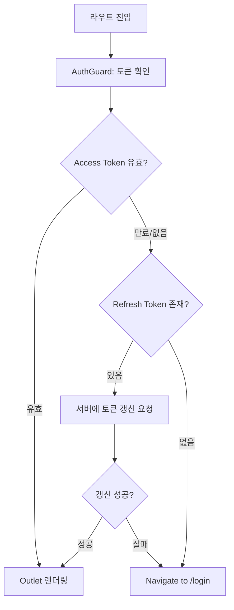
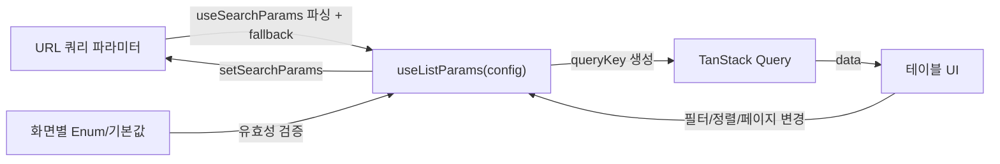
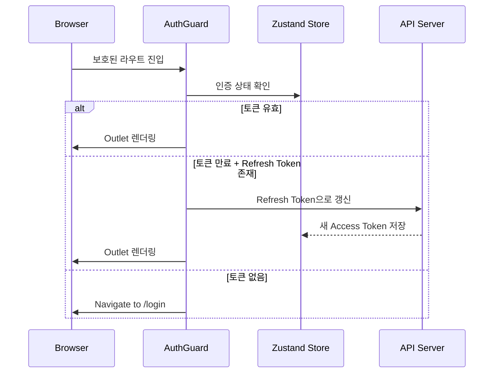
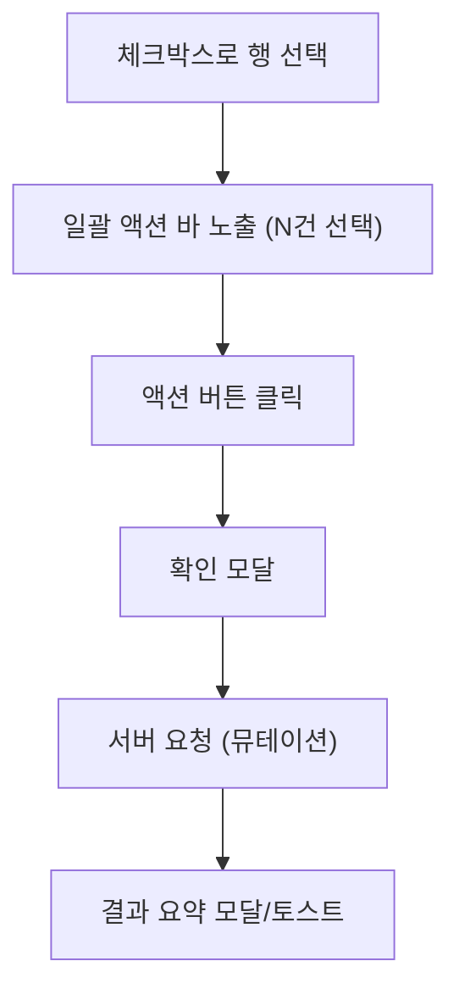
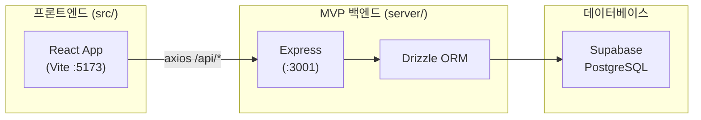
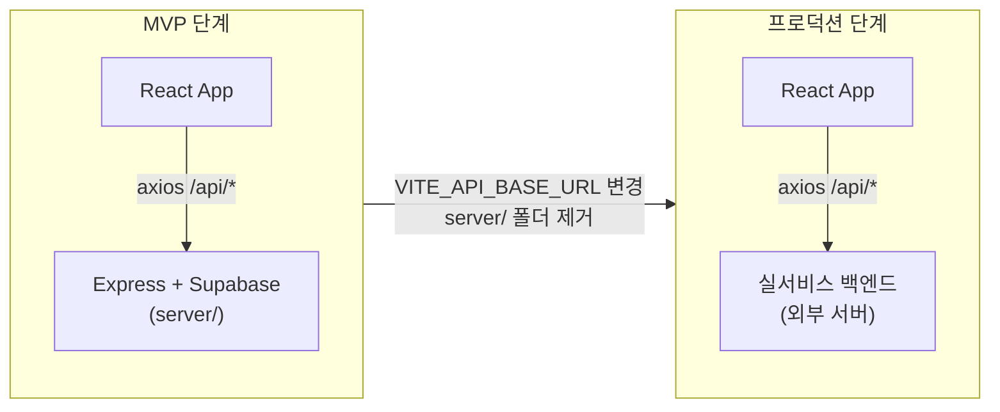

# 요양원-물류센터 물류 관리 서비스 프론트엔드 아키텍처

## 1. 프로젝트 성격 분석

기획 문서([docs/index.md](docs/index.md))와 디자인 시스템([design-system/@index.md](design-system/@index.md))에서 도출한 핵심 특성:

- **데스크톱 전용** 어드민 콘솔 (최소 1280x800)
- **테이블 중심** 고밀도 데이터 UI (주문/배송/재고/정산 목록)
- **역할 기반 접근 제어**: 요양원 관리자, 물류센터 관리자, (향후) 회사 관리자
- **URL 쿼리 동기화**: 필터/검색/정렬/페이지네이션이 URL과 완전 동기화 ([docs/list-conventions.md](docs/list-conventions.md))
- **실시간 알림**: 인앱 + 이메일 채널 ([docs/notification.md](docs/notification.md))
- **JWT 기반 인증**: Access Token(60분) + Refresh Token(30일) ([docs/auth.md](docs/auth.md))
- **일괄 처리 패턴**: 다중 선택 후 상태 변경, 엑셀 업로드/다운로드
- **CSR SPA**: 인증 후 진입하는 어드민 콘솔이므로 SEO 불필요
- **MVP 백엔드**: Express + Supabase + Drizzle (실서비스 백엔드 완성 시 엔드포인트만 교체)

---

## 2. 기술 스택


| 레이어          | 선택                                   | 근거                                                                      |
| ------------ | ------------------------------------ | ----------------------------------------------------------------------- |
| **빌드**       | Vite 7                               | Rolldown 프리뷰 탑재, 빠른 HMR, baseline-widely-available 타겟                   |
| **UI**       | React 19                             | 최신 안정 버전, CSR SPA                                                       |
| **언어**       | TypeScript (strict)                  | 디자인 토큰/enum 타입 안전성                                                      |
| **라우팅**      | React Router v6                      | 중첩 라우트, Outlet 기반 레이아웃, `useSearchParams` URL 동기화                       |
| **서버 상태**    | TanStack Query v5                    | 캐싱, 자동 갱신, 낙관적 업데이트                                                     |
| **클라이언트 상태** | Zustand                              | 인증/사이드바/알림 카운트 등 경량 전역 상태                                               |
| **스타일링**     | Tailwind CSS v4 + CSS Variables      | 디자인 토큰을 CSS 변수로, Tailwind로 빠른 레이아웃                                      |
| **컴포넌트**     | 자체 디자인 시스템 (Radix UI Primitives 기반)  | 기획서의 독자적 디자인 토큰/컴포넌트 스펙 반영                                              |
| **폼**        | React Hook Form + Zod                | 필터/검색/폼 모달의 유효성 검증                                                      |
| **테이블**      | TanStack Table v8                    | 정렬/선택/고정 컬럼/행 강조 등 어드민 테이블 요구사항                                         |
| **아이콘**      | Lucide React                         | 디자인 시스템 명시 ([design-system/tokens.md](design-system/tokens.md))         |
| **날짜**       | dayjs                                | 기간 필터, 정산 기간, 발송 기한 계산. 경량(2KB) + 플러그인 확장                               |
| **엑셀**       | SheetJS (xlsx)                       | 엑셀 일괄 업로드/다운로드                                                          |
| **HTTP**     | ky 또는 Axios                          | API 클라이언트 + 인터셉터                                                        |
| **실시간**      | SSE 또는 WebSocket                     | 알림 실시간 수신                                                               |
| **MVP 서버**   | Express                              | 라우트/미들웨어 기반 REST API. MVP 전용, 실서비스 전환 시 제거                              |
| **MVP DB**   | Supabase (PostgreSQL) + Drizzle ORM  | Supabase 호스팅 DB + Drizzle 타입 안전 쿼리. 스키마를 `types/`와 공유                   |
| **테스트**      | Vitest + React Testing Library       | Vite 네이티브 통합, TDD 워크플로우. 컴포넌트 테스트에 jsdom + RTL, API 테스트에 `vi.mock` 사용 |
| **린트**       | ESLint 9 + typescript-eslint         | Flat Config, React/import/a11y 플러그인. Prettier 불필요 (ESLint Stylistic 사용) |


---

## 3. 디렉토리 구조

기획 문서(`docs/`)와 디자인 시스템(`design-system/`)이 이미 존재하는 현재 레포에 프론트엔드(`src/`)와 MVP 백엔드(`server/`)를 추가한다.

```
nursing-hospital/                 # 현재 레포 루트
├── docs/                         # 기획 문서 (기존)
├── design-system/                # 디자인 시스템 문서 (기존)
├── .cursor/                      # Cursor 규칙/스킬 (기존)
│
├── index.html                    # Vite 엔트리 HTML
├── package.json
├── vite.config.ts
├── vitest.config.ts              # Vitest 설정 (vitest.workspace 없이 단일 config)
├── eslint.config.ts              # ESLint 9 Flat Config (typescript-eslint + React + import + a11y)
├── tailwind.config.ts
├── tsconfig.json
├── .env.development              # VITE_API_BASE_URL=http://localhost:3001
├── .env.production               # VITE_API_BASE_URL (실서비스 백엔드 URL)
│
├── server/                       # MVP 백엔드 (Express + Drizzle + Supabase)
│   ├── package.json              # 서버 전용 의존성 (express, drizzle-orm, @supabase/supabase-js 등)
│   ├── tsconfig.json             # 서버 전용 TS 설정
│   ├── .env                      # DATABASE_URL, SUPABASE_URL, SUPABASE_ANON_KEY, JWT_SECRET
│   ├── src/
│   │   ├── index.ts              # Express 앱 진입점 (listen :3001)
│   │   ├── app.ts                # Express 인스턴스 + 미들웨어 (cors, json, auth)
│   │   ├── db/
│   │   │   ├── client.ts         # Drizzle + Supabase PostgreSQL 연결
│   │   │   ├── schema/           # Drizzle 스키마 정의 (도메인별)
│   │   │   │   ├── orders.ts
│   │   │   │   ├── deliveries.ts
│   │   │   │   ├── inventory.ts
│   │   │   │   ├── settlements.ts
│   │   │   │   └── users.ts
│   │   │   └── seed.ts           # 개발용 시드 데이터
│   │   ├── routes/               # Express 라우터 (도메인별)
│   │   │   ├── auth.ts
│   │   │   ├── orders.ts
│   │   │   ├── deliveries.ts
│   │   │   ├── inventory.ts
│   │   │   └── settlements.ts
│   │   ├── middleware/
│   │   │   ├── auth.ts           # JWT 검증 미들웨어
│   │   │   └── error-handler.ts  # 글로벌 에러 핸들러
│   │   └── lib/
│   │       └── jwt.ts            # JWT 발급/검증 유틸
│   └── drizzle.config.ts         # Drizzle Kit 설정 (마이그레이션)
│
└── src/                          # 프론트엔드 (React)
    ├── test/                     # 테스트 인프라
    │   ├── setup.ts              # Vitest setupFiles (RTL cleanup)
    │   └── test-utils.tsx        # render 래퍼 (Providers 포함), custom queries
    │
    ├── main.tsx                  # React DOM 마운트 + Providers
    ├── App.tsx                   # React Router 라우트 정의
    │
    ├── routes/                   # 페이지 컴포넌트 (라우트 단위)
    │   ├── auth/
    │   │   ├── LoginPage.tsx
    │   │   └── ResetPasswordPage.tsx
    │   ├── logistics/
    │   │   ├── orders/
    │   │   │   ├── OrderListPage.tsx
    │   │   │   └── OrderDetailPage.tsx
    │   │   ├── deliveries/
    │   │   │   ├── DeliveryListPage.tsx
    │   │   │   ├── DeliveryDetailPage.tsx
    │   │   │   └── DeliveryExcelUploadPage.tsx
    │   │   ├── inventory/
    │   │   │   ├── InventoryListPage.tsx
    │   │   │   └── InventoryDetailPage.tsx
    │   │   ├── settlements/
    │   │   │   ├── SettlementListPage.tsx
    │   │   │   ├── InvoiceDetailPage.tsx
    │   │   │   └── SettlementSummaryPage.tsx
    │   │   ├── returns/
    │   │   │   └── ReturnManagementPage.tsx
    │   │   └── settings/
    │   │       └── CategorySettingsPage.tsx
    │   └── notifications/
    │       └── NotificationListPage.tsx
    │
    ├── components/
    │   ├── ui/                   # 디자인 시스템 기반 원자 컴포넌트
    │   │   ├── Button.tsx
    │   │   ├── Input.tsx
    │   │   ├── Select.tsx
    │   │   ├── DataTable/
    │   │   ├── Badge.tsx
    │   │   ├── Modal.tsx
    │   │   ├── Toast.tsx
    │   │   ├── Tabs.tsx
    │   │   ├── Pagination.tsx
    │   │   ├── Breadcrumb.tsx
    │   │   ├── Card.tsx
    │   │   ├── Tooltip.tsx
    │   │   ├── DateRangePicker.tsx
    │   │   └── Skeleton.tsx
    │   ├── layout/
    │   │   ├── DashboardLayout.tsx
    │   │   ├── AuthLayout.tsx
    │   │   ├── Header.tsx
    │   │   ├── Sidebar.tsx
    │   │   └── ContentSection.tsx
    │   ├── guards/
    │   │   ├── AuthGuard.tsx
    │   │   └── RoleGuard.tsx
    │   └── domain/               # 도메인 조합 컴포넌트
    │       ├── order/
    │       ├── delivery/
    │       ├── inventory/
    │       └── settlement/
    │
    ├── hooks/
    │   ├── useListParams.ts
    │   ├── useAuth.ts
    │   ├── useNotifications.ts
    │   └── useBatchAction.ts
    │
    ├── lib/
    │   ├── api/
    │   │   ├── client.ts         # 인스턴스 + 인터셉터 (401 자동 갱신)
    │   │   ├── auth.ts           # 로그인/로그아웃/토큰 갱신 API 함수
    │   │   ├── orders.ts         # 주문 CRUD API 함수
    │   │   ├── deliveries.ts
    │   │   ├── inventory.ts
    │   │   ├── settlements.ts
    │   │   └── @queries/         # queryOptions 팩토리 (도메인별)
    │   │       ├── orders.ts     # export const orderQueries = { ... }
    │   │       ├── deliveries.ts # export const deliveryQueries = { ... }
    │   │       ├── inventory.ts
    │   │       ├── settlements.ts
    │   │       └── notifications.ts
    │   ├── auth/
    │   │   └── token-store.ts
    │   └── utils/
    │       ├── format.ts
    │       ├── excel.ts
    │       └── url-params.ts
    │
    ├── stores/                   # Zustand
    │   ├── auth-store.ts
    │   ├── sidebar-store.ts
    │   └── notification-store.ts
    │
    ├── providers/
    │   └── AppProviders.tsx
    │
    ├── styles/
    │   └── globals.css           # CSS 변수 (디자인 토큰) + Tailwind
    │
    └── types/                    # 여러 곳에서 공유하는 타입만 위치
        ├── api/                  # API 계약 타입 (요청/응답) — 다수 레이어에서 참조
        │   ├── auth.ts
        │   ├── orders.ts
        │   └── ...
        ├── domain/               # 도메인 모델 타입 + 상태 enum — 다수 컴포넌트에서 참조
        │   ├── order.ts
        │   ├── delivery.ts
        │   ├── inventory.ts
        │   └── settlement.ts
        └── common.ts             # PaginatedResponse, ListParams 등
```

### Co-location 원칙 (타입 / 유틸 / 훅)

타입, 유틸 함수, 커스텀 훅 모두 동일한 배치 규칙을 따른다. **사용 범위가 좁으면 가까이, 넓으면 공유 폴더에.**


| 사용 범위                  | 타입                | 유틸 함수             | 커스텀 훅              |
| ---------------------- | ----------------- | ----------------- | ------------------ |
| **앱 전체 공유**            | `types/`          | `lib/utils/`      | `hooks/`           |
| **특정 폴더 내 2+ 파일에서 사용** | 가장 가까운 `types.ts` | 가장 가까운 `utils.ts` | 가장 가까운 `useXxx.ts` |
| **단일 파일 전용**           | 해당 파일 상단에 선언      | 해당 파일 내 함수로 선언    | 해당 파일 내 훅으로 선언     |


```
routes/logistics/orders/
├── OrderListPage.tsx
├── OrderDetailPage.tsx
├── types.ts              # 폴더 내 공유 타입 (OrderListFilter, OrderDetailTab)
├── utils.ts              # 폴더 내 공유 유틸 (formatOrderNumber, calcOrderTotal)
└── useOrderActions.ts    # 폴더 내 공유 훅 (주문 승인/반려 뮤테이션 조합)

components/domain/order/
├── OrderStatusBadge.tsx   # Props는 파일 상단, 헬퍼 함수도 파일 내 선언
└── OrderTable/
    ├── OrderTable.tsx
    ├── OrderTableRow.tsx
    ├── types.ts           # OrderTableColumn, OrderRowAction
    └── utils.ts           # getRowClassName, sortByDeliveryDate
```

**판단 기준**: 해당 코드를 삭제할 때 타입/유틸/훅도 함께 삭제할 수 있으면 올바른 위치에 있는 것이다.

---

## 4. 라우트 구조

React Router v6의 중첩 라우트와 `<Outlet />`을 활용하여 레이아웃을 구성한다.

```tsx
// App.tsx 라우트 구조 (개념)
<Routes>
  {/* 인증 페이지 - AuthLayout */}
  <Route element={<AuthLayout />}>
    <Route path="/login" element={<LoginPage />} />
    <Route path="/reset-password" element={<ResetPasswordPage />} />
  </Route>

  {/* 대시보드 - AuthGuard로 보호 + DashboardLayout */}
  <Route element={<AuthGuard />}>
    <Route element={<DashboardLayout />}>
      {/* 물류센터 관리자 */}
      <Route path="/logistics/orders" element={<OrderListPage />} />
      <Route path="/logistics/orders/:id" element={<OrderDetailPage />} />
      <Route path="/logistics/deliveries" element={<DeliveryListPage />} />
      <Route path="/logistics/deliveries/:id" element={<DeliveryDetailPage />} />
      <Route path="/logistics/inventory" element={<InventoryListPage />} />
      <Route path="/logistics/inventory/:id" element={<InventoryDetailPage />} />
      <Route path="/logistics/settlements" element={<SettlementListPage />} />
      <Route path="/logistics/settlements/:id" element={<InvoiceDetailPage />} />
      <Route path="/logistics/returns" element={<ReturnManagementPage />} />
      <Route path="/logistics/settings/category" element={<CategorySettingsPage />} />
      <Route path="/notifications" element={<NotificationListPage />} />

      {/* (향후) 요양원 관리자 */}
      {/* <Route path="/nursing/..." /> */}
    </Route>
  </Route>

  {/* 404 */}
  <Route path="*" element={<NotFoundPage />} />
</Routes>
```

### AuthGuard 컴포넌트 역할




- 서버 미들웨어가 아닌 **클라이언트 라우트 가드**로 인증을 처리
- `AuthGuard`가 `<Outlet />`을 감싸므로, 하위 모든 라우트가 자동으로 보호됨
- 인증 상태는 Zustand `auth-store`에서 관리

---

## 5. 핵심 아키텍처 패턴

### 5-1. URL 쿼리 동기화 (리스트 화면의 심장)

[docs/list-conventions.md](docs/list-conventions.md)의 정책을 `useListParams` 훅으로 캡슐화한다. React Router v6의 `useSearchParams`를 내부에서 사용한다.




- `useSearchParams`로 URL 읽기/쓰기, `navigate`로 replace 동작 수행
- 각 리스트 화면은 config 객체(허용 enum, 기본값)만 정의하면 공통 동작이 자동 적용
- 사용자 액션은 `push` (히스토리에 추가), 잘못된 파라미터 보정은 `replace` (히스토리 교체)
- 기본값은 URL에서 생략하여 URL 가독성 확보

### 5-2. 인증 흐름 (CSR)




- Access Token: 메모리(Zustand) 또는 localStorage (60분)
- Refresh Token: httpOnly 쿠키 (30일, 자동 로그인 시) -- 서버에서 쿠키로 관리하는 것이 이상적
- API 클라이언트 인터셉터에서 401 응답 시 자동 갱신 시도, 실패 시 로그아웃

### 5-3. 서버 상태 관리 (TanStack Query — queryOptions 팩토리 패턴)

커스텀 훅(`useOrders`) 대신 **queryOptions 팩토리 객체**를 사용한다. `queryOptions()`로 타입 안전한 옵션 객체를 만들고, 컴포넌트에서 `useQuery(orderQueries.list(params))`로 직접 소비한다.

```
lib/api/@queries/
├── orders.ts             # orderQueries 팩토리 객체
├── deliveries.ts         # deliveryQueries
├── inventory.ts          # inventoryQueries
├── settlements.ts        # settlementQueries
└── notifications.ts      # notificationQueries
```

#### 팩토리 구조 예시 (`lib/api/@queries/orders.ts`)

```ts
import { queryOptions } from '@tanstack/react-query'
import { getOrders, getOrderDetail } from '../orders'
import type { GetOrdersParams } from '@/types/api/orders'

export const orderQueries = {
  all: () => ['orders'] as const,

  lists: () => [...orderQueries.all(), 'list'] as const,
  list: (params: GetOrdersParams) =>
    queryOptions({
      queryKey: [...orderQueries.lists(), params],
      queryFn: () => getOrders(params),
      staleTime: 30_000,
    }),

  details: () => [...orderQueries.all(), 'detail'] as const,
  detail: (id: string) =>
    queryOptions({
      queryKey: [...orderQueries.details(), id],
      queryFn: () => getOrderDetail(id),
      staleTime: 60_000,
    }),
}
```

#### 컴포넌트에서 사용

```tsx
// OrderListPage.tsx
const params = useListParams(orderListConfig)
const { data, isLoading } = useQuery(orderQueries.list(params))

// OrderDetailPage.tsx
const { id } = useParams()
const { data } = useSuspenseQuery(orderQueries.detail(id!))
```

#### 뮤테이션에서 invalidation

```tsx
const queryClient = useQueryClient()
const mutation = useMutation({
  mutationFn: approveOrders,
  onSuccess: () => {
    queryClient.invalidateQueries({ queryKey: orderQueries.lists() })
  },
})
```

**이 패턴의 장점:**

- **queryKey 일관성**: 팩토리 내에서 키 계층이 관리되므로 오타/불일치 방지
- **타입 추론**: `queryOptions()`가 queryFn 반환 타입을 자동 추론 → `useQuery` 결과에 별도 제네릭 불필요
- **invalidation 계층**: `orderQueries.all()`로 주문 전체, `orderQueries.lists()`로 목록만 선택적 무효화
- **재사용성**: 같은 쿼리 옵션을 `useQuery`, `useSuspenseQuery`, `prefetchQuery` 등에서 동일하게 사용
- **낙관적 업데이트**: 일괄 상태 변경 시 즉시 UI 반영 후 서버 확인
- **staleTime/gcTime**: 어드민 특성상 데이터 신선도 중요, staleTime은 짧게 (30초~1분)

### 5-4. 레이아웃 구조

[design-system/layout.md](design-system/layout.md)를 `DashboardLayout` 컴포넌트로 구현한다.

```
DashboardLayout.tsx
├── Header (64px 고정, sticky top)
│   ├── Logo (좌측)
│   └── 알림 벨 + 사용자 메뉴 (우측)
├── Sidebar (240px, 접으면 64px)
│   └── 역할별 메뉴 + 미처리 건수 뱃지 (현재 경로 useLocation 하이라이트)
└── <Outlet />  →  ContentArea (max-width 1440px, 패딩 32px/24px)
    ├── Breadcrumb
    ├── PageTitle + PageActions
    ├── StatusTabs + KPI
    ├── FilterBar
    ├── SubActionBar
    ├── BatchActionBar (선택 시 표시)
    ├── Table
    └── Pagination
```

### 5-5. 디자인 토큰 적용

[design-system/color.md](design-system/color.md), [design-system/tokens.md](design-system/tokens.md)의 모든 토큰을 CSS 변수로 선언한다.

```css
/* globals.css */
:root {
  --color-primary-brown: #7E4F40;
  --color-secondary-brown: #A47768;
  --color-secondary-pink: #FFF1EC;
  /* ... 전체 토큰 */

  --space-1: 4px;
  --space-2: 8px;
  /* ... */

  --radius-sm: 4px;
  --radius-md: 6px;
  /* ... */
}
```

Tailwind에서 CSS 변수를 참조하도록 `tailwind.config.ts`를 확장하여, 디자인 시스템 규칙(`.cursor/rules/design-system.mdc`)의 "HEX 직접 사용 금지" 원칙을 자연스럽게 준수한다.

---

## 6. Provider 구조

`main.tsx`에서 앱 전체를 감싸는 Provider 계층:

```
<BrowserRouter>
  <QueryClientProvider>
    <AppProviders>       # Toaster, 글로벌 에러 바운더리 등
      <App />            # Routes 정의
    </AppProviders>
  </QueryClientProvider>
</BrowserRouter>
```

---

## 7. 주요 공유 패턴

### 리스트 페이지 템플릿

모든 리스트 화면(주문 목록, 배송 목록, 재고 목록 등)은 동일한 구조를 따른다:

```
ListPage(config)
├── useListParams(config)                # URL 파라미터 파싱/동기화
├── useQuery(domainQueries.list(params)) # queryOptions 팩토리로 데이터 패칭
├── StatusTabs                           # 상태별 카운트 탭
├── FilterBar                            # 필터/검색 UI
├── BatchActionBar                       # 일괄 처리 (선택 시)
├── DataTable                            # TanStack Table
└── Pagination                           # 페이지네이션
```

### 일괄 처리 플로우




---

## 8. MVP 개발 전략

### 8-1. 3-레이어 아키텍처

MVP 단계에서 실제 HTTP 호출과 DB 영속성을 갖춘 백엔드를 구동한다.



### 8-2. 로컬 구동

```bash
cd nursing-hospital

# 1) 프론트엔드 의존성
npm install

# 2) MVP 서버 의존성
cd server && npm install && cd ..

# 3) 동시 구동
npm run dev          # Vite 프론트 (:5173) + Express 서버 (:3001) concurrently
```

Vite 프록시가 `/api/*` 요청을 Express 서버로 포워딩하므로 CORS 설정 없이 개발 가능.

### 8-3. 2단계 전환: MVP에서 실서비스로



전환 시 작업:

- `.env.production`에서 `VITE_API_BASE_URL=https://api.example.com`로 변경
- `server/` 폴더 삭제 (또는 레포에서 제외)
- **프론트엔드 코드 변경 없음** — API 클라이언트가 동일한 엔드포인트 경로를 호출

### 8-4. Express 서버 구조

```ts
// server/src/app.ts 개념
const app = express();

app.use(cors());
app.use(express.json());

// JWT 인증 미들웨어
app.use('/api', authMiddleware);

// 도메인별 라우터
app.use('/api/auth', authRouter);
app.use('/api/orders', ordersRouter);
app.use('/api/deliveries', deliveriesRouter);
app.use('/api/inventory', inventoryRouter);
app.use('/api/settlements', settlementsRouter);

// 글로벌 에러 핸들러
app.use(errorHandler);
```

### 8-5. Drizzle 스키마 + Supabase 연결

```ts
// server/src/db/client.ts
import { drizzle } from 'drizzle-orm/postgres-js';
import postgres from 'postgres';
import * as schema from './schema';

const connection = postgres(process.env.DATABASE_URL!);
export const db = drizzle(connection, { schema });
```

Drizzle Kit으로 마이그레이션 관리:

```bash
cd server
npx drizzle-kit generate   # 스키마 변경 → SQL 마이그레이션 생성
npx drizzle-kit migrate    # 마이그레이션 실행
npx drizzle-kit studio     # DB 브라우저 UI
```

### 8-6. 추천 개발 순서 (기능 단위 수직 슬라이스)

화면 하나를 **테스트 작성 → UI 구현 → API + DB 연동 → 테스트 통과** 사이클로 완성한 뒤 다음으로 넘어간다 (TDD).

| 순서               | 작업                                           | 산출물                                               |
| ---------------- | -------------------------------------------- | ------------------------------------------------- |
| **0-a**          | 프론트 스캐폴딩 + 디자인 토큰 + 레이아웃 + Vitest + ESLint   | `npm run dev` (프론트) 구동 확인                          |
| **0-b**          | Express + Supabase + Drizzle 서버 세팅 + 스키마 설계   | `npm run dev` (서버) 구동 + DB 연결 확인                    |
| **1**            | 로그인/인증 (테스트 → UI → API → DB)                 | 로그인 화면, JWT 발급/검증, AuthGuard + 테스트                 |
| **2**            | 주문 목록 (테스트 → UI → API → DB → useListParams) | 리스트 패턴의 기준 화면 + 테스트                               |
| **3**            | 주문 상세 (테스트 → UI → API → DB)                  | 상세 패턴의 기준 화면 + 테스트                                |
| **4**            | 배송 관리 (목록 + 상세 + 엑셀)                         | 리스트 패턴 재사용 검증 + 테스트                               |
| **5**            | 재고 관리                                        | 패턴 복제 + 테스트                                       |
| **6**            | 정산 관리                                        | 패턴 복제 + 테스트                                       |
| **7**            | 반품/설정/알림                                     | 나머지 화면 + 테스트                                      |
| **-- MVP 완료 --** |                                              | **프론트 + Express 백엔드 + Supabase DB 전체 동작 + 테스트 통과** |
| **8**            | 실서비스 백엔드 연동                                  | `VITE_API_BASE_URL` 변경, `server/` 제거               |

### 8-7. 실서비스 백엔드 연동 준비

프론트에서 API 호출 구조를 처음부터 실서비스 기준으로 설계해둔다.

- `lib/api/client.ts`: base URL을 `VITE_API_BASE_URL` 환경 변수에서 읽음
- `types/api/`: 요청/응답 타입을 엄격하게 정의 → 실서비스 백엔드에서 동일 구조로 JSON 응답
- 인증: JWT 토큰 기반으로 설계 (Express에서 발급 → 실서비스에서도 동일 방식)
- Vite 프록시 설정으로 개발 시 CORS 문제 회피:

```ts
// vite.config.ts
export default defineConfig({
  server: {
    proxy: {
      '/api': {
        target: 'http://localhost:3001', // Express MVP 서버
        changeOrigin: true,
      },
    },
  },
})
```

### 8-8. npm scripts (루트 package.json)

```json
{
  "dev": "concurrently \"npm run dev:client\" \"npm run dev:server\"",
  "dev:client": "vite",
  "dev:server": "npm run dev --prefix server",
  "build": "vite build",
  "test": "vitest",
  "test:run": "vitest run",
  "lint": "eslint .",
  "lint:fix": "eslint . --fix",
  "db:generate": "npm run db:generate --prefix server",
  "db:migrate": "npm run db:migrate --prefix server",
  "db:studio": "npm run db:studio --prefix server",
  "db:seed": "npm run db:seed --prefix server"
}
```

---

## 9. Vite 설정 포인트

- **환경 변수**: `.env.development`(`VITE_API_BASE_URL=http://localhost:3001`) / `.env.production`(`VITE_API_BASE_URL`)
- **프록시**: 개발 시 `/api/*` → `http://localhost:3001` (Express MVP 서버)
- **빌드 최적화**: `build.rollupOptions.output.manualChunks`로 vendor 번들 분리
- **SPA Fallback**: 배포 시 모든 경로를 `index.html`로 리다이렉트 (Nginx rewrite 등)
- **빌드 출력**: `dist/`를 정적 호스팅(Vercel/S3/Nginx)에 배포, API는 별도 서버

---

## 10. 테스트 전략 (TDD with Vitest)

### 10-1. 테스트 도구 구성

- **Vitest**: Vite 네이티브 테스트 러너. `vite.config.ts`의 alias/환경 설정을 자동 공유
- **React Testing Library (RTL)**: 사용자 행동 기반 컴포넌트 테스트
- **@testing-library/user-event**: 클릭/타이핑 등 실제 사용자 인터랙션 시뮬레이션
- **vi.mock()**: API 함수를 모킹하여 컴포넌트/훅 테스트에서 서버 의존성 제거

### 10-2. 테스트 인프라 구조

```
src/test/
├── setup.ts            # Vitest setupFiles: RTL cleanup
└── test-utils.tsx      # 커스텀 render — QueryClient + BrowserRouter + 기타 Provider 래핑
```

### 10-3. vitest.config.ts 핵심 설정

```ts
import { defineConfig } from 'vitest/config'
import react from '@vitejs/plugin-react'
import tsconfigPaths from 'vite-tsconfig-paths'

export default defineConfig({
  plugins: [react(), tsconfigPaths()],
  test: {
    globals: true,
    environment: 'jsdom',
    setupFiles: ['./src/test/setup.ts'],
    include: ['src/**/*.test.{ts,tsx}'],
    css: false,
  },
})
```

### 10-4. 커스텀 render 래퍼 (`test-utils.tsx`)

```tsx
import { render, type RenderOptions } from '@testing-library/react'
import { QueryClient, QueryClientProvider } from '@tanstack/react-query'
import { BrowserRouter } from 'react-router-dom'

function createTestQueryClient() {
  return new QueryClient({
    defaultOptions: { queries: { retry: false, gcTime: 0 } },
  })
}

function AllProviders({ children }: { children: React.ReactNode }) {
  const queryClient = createTestQueryClient()
  return (
    <QueryClientProvider client={queryClient}>
      <BrowserRouter>{children}</BrowserRouter>
    </QueryClientProvider>
  )
}

const customRender = (ui: React.ReactElement, options?: RenderOptions) =>
  render(ui, { wrapper: AllProviders, ...options })

export * from '@testing-library/react'
export { customRender as render }
```

### 10-5. TDD 워크플로우

각 기능을 구현할 때 아래 사이클을 따른다:

1. **Red**: 실패하는 테스트 작성 — 기대하는 사용자 행동/결과를 먼저 정의
2. **Green**: 테스트를 통과하는 최소 구현
3. **Refactor**: 코드 개선 (테스트는 계속 통과해야 함)

### 10-6. 테스트 범위 우선순위


| 우선순위   | 대상                                   | 테스트 방법                              |
| ------ | ------------------------------------ | ----------------------------------- |
| **필수** | 공유 훅 (`useListParams`, `useAuth`)    | 단위 테스트 (`renderHook`)               |
| **필수** | queryOptions 팩토리                     | 단위 테스트 (queryKey 구조, queryFn 호출 검증) |
| **필수** | 리스트 페이지 흐름 (필터 → 테이블 → 페이지네이션)       | 통합 테스트 (RTL + vi.mock)              |
| **필수** | 인증 흐름 (로그인 → 가드 → 리다이렉트)             | 통합 테스트 (RTL + vi.mock)              |
| **권장** | UI 컴포넌트 (`Button`, `Badge`, `Modal`) | 컴포넌트 테스트 (RTL)                      |
| **권장** | 일괄 처리 플로우 (선택 → 확인 → 뮤테이션)           | 통합 테스트                              |
| **선택** | 유틸 함수 (`format`, `url-params`)       | 단위 테스트                              |


### 10-7. 테스트 파일 배치 (Co-location)

테스트 파일은 대상 파일과 같은 폴더에 `.test.ts(x)` 접미사로 둔다:

```
hooks/
├── useListParams.ts
└── useListParams.test.ts

routes/logistics/orders/
├── OrderListPage.tsx
└── OrderListPage.test.tsx

lib/api/@queries/
├── orders.ts
└── orders.test.ts

components/ui/
├── Button.tsx
└── Button.test.tsx
```

---

## 11. ESLint 설정 (Flat Config — 팀 규칙 마이그레이션)

기존 팀 `.eslintrc.js` 규칙을 ESLint 9 Flat Config(`eslint.config.ts`)로 마이그레이션한다.

### 11-1. 사용 패키지

- `@eslint/js` — ESLint 기본 recommended
- `typescript-eslint` — 파서 + 타입 인식 규칙 (v8, ESLint 9 네이티브 지원)
- `eslint-plugin-react` + `eslint-plugin-react-hooks` — React 패턴 준수
- `eslint-plugin-jsx-a11y` — 접근성 규칙 (디자인 시스템 요구사항)
- `eslint-plugin-import-x` — import 순서 정리, 미사용 import 감지
- `@stylistic/eslint-plugin` — 포매팅 규칙 (Prettier 대체)

### 11-2. 구버전 → v9 규칙 마이그레이션 맵

| 구버전 규칙 | v9 대응 | 비고 |
|-----------|---------|------|
| `@typescript-eslint/no-explicit-any: 'error'` | 동일 | 팀 핵심: any 금지 |
| `@typescript-eslint/no-shadow: 'error'` | 동일 | 변수 섀도잉 금지 |
| `@typescript-eslint/func-call-spacing` | `@stylistic/ts/function-call-spacing` | deprecated → Stylistic으로 이동 |
| `prefer-const: 'error'` | 동일 (ESLint 코어) | |
| `eqeqeq: ['error', 'always']` | 동일 | === 강제 |
| `curly: ['error', 'all']` | 동일 | 중괄호 필수 |
| `array-callback-return: 'error'` | 동일 | |
| `prefer-arrow-callback: 'error'` | 동일 | |
| `no-useless-concat: 'error'` | 동일 | |
| `no-eval: 'error'` | 동일 | |
| `react/react-in-jsx-scope: 'off'` | 동일 | React 17+ 자동 import |
| `react/prop-types: 'off'` | 동일 | TypeScript 사용으로 불필요 |
| `prettier/prettier: 'error'` | 제거 → `@stylistic` | Prettier 통합 제거, Stylistic으로 대체 |

### 11-3. eslint.config.ts

```ts
import eslint from '@eslint/js'
import tseslint from 'typescript-eslint'
import react from 'eslint-plugin-react'
import reactHooks from 'eslint-plugin-react-hooks'
import jsxA11y from 'eslint-plugin-jsx-a11y'
import importX from 'eslint-plugin-import-x'
import stylistic from '@stylistic/eslint-plugin'

export default tseslint.config(
  // ── 기본 추천 규칙 ──
  eslint.configs.recommended,
  ...tseslint.configs.recommended,

  // ── Stylistic (Prettier 대체) ──
  stylistic.configs.customize({
    semi: true,
    singleQuote: true,
    jsx: true,
    indent: 2,
    arrowParens: true,
    commaDangle: 'always-multiline',
  }),

  // ── 소스 코드 규칙 ──
  {
    files: ['src/**/*.{ts,tsx}'],
    plugins: {
      react,
      'react-hooks': reactHooks,
      'jsx-a11y': jsxA11y,
      'import-x': importX,
    },
    languageOptions: {
      parserOptions: {
        ecmaFeatures: { jsx: true },
      },
    },
    settings: {
      react: { version: 'detect' },
    },
    rules: {
      // ── 팀 핵심 규칙 (기존 유지) ──
      '@typescript-eslint/no-explicit-any': 'error',
      '@typescript-eslint/no-shadow': 'error',
      '@typescript-eslint/no-unused-vars': ['warn', { argsIgnorePattern: '^_' }],
      'prefer-const': 'error',
      eqeqeq: ['error', 'always'],
      curly: ['error', 'all'],

      // ── 코드 품질 (기존 유지) ──
      'array-callback-return': 'error',
      'prefer-arrow-callback': 'error',
      'no-useless-concat': 'error',
      'no-eval': 'error',

      // ── React ──
      ...reactHooks.configs.recommended.rules,
      'react/react-in-jsx-scope': 'off',
      'react/prop-types': 'off',

      // ── 접근성 (신규 — 디자인 시스템 요구사항) ──
      'jsx-a11y/anchor-is-valid': 'warn',

      // ── Import 정리 (신규) ──
      'import-x/order': ['warn', {
        groups: ['builtin', 'external', 'internal', 'parent', 'sibling', 'index'],
        'newlines-between': 'always',
      }],

      // ── Stylistic ──
      '@stylistic/function-call-spacing': ['error', 'never'],
      '@stylistic/max-len': ['warn', { code: 100 }],
    },
  },

  // ── 무시 대상 ──
  {
    ignores: ['dist/', 'node_modules/', '*.config.*'],
  },
)
```

### 11-4. Prettier 제거, @stylistic 사용

기존 팀 설정에서 `prettier/prettier`, `eslint-config-prettier`, `eslint-plugin-prettier`를 사용했으나, v9에서는 제거한다. 포매팅 규칙은 `@stylistic/eslint-plugin`이 담당하여 **ESLint 하나로 린트 + 포매팅을 모두 처리**한다.

팀 `.prettierrc`와 동일하게 매핑된 설정:

| `.prettierrc` | `@stylistic` customize | 비고 |
|--------------|----------------------|------|
| `"semi": true` | `semi: true` | 세미콜론 사용 |
| `"singleQuote": true` | `singleQuote: true` | 작은따옴표 |
| `"printWidth": 100` | `@stylistic/max-len: ['warn', { code: 100 }]` | 경고만 (자동 줄바꿈은 미지원) |
| `"trailingComma": "all"` | `commaDangle: 'always-multiline'` | 여러 줄일 때 후행 쉼표 |
| `"endOfLine": "auto"` | (기본 동작) | OS 따라 자동 |

---

## 12. 향후 확장 고려사항

- **요양원 관리자 콘솔**: `/nursing/*` 라우트 그룹으로 추가, 동일 컴포넌트 재사용
- **회사 관리자 콘솔**: 별도 프로젝트 또는 `/admin/*` 라우트 그룹
- **다크 모드**: CSS 변수 기반이므로 `:root[data-theme="dark"]` 추가만으로 대응 가능
- **코드 스플리팅**: React Router의 `lazy()`로 라우트별 코드 분할
- **저장된 뷰 (View Preset)**: `useListParams`에 프리셋 저장/불러오기 기능 확장
- **멀티 정렬**: `sort` 파라미터를 세미콜론 구분 다중 값으로 확장

