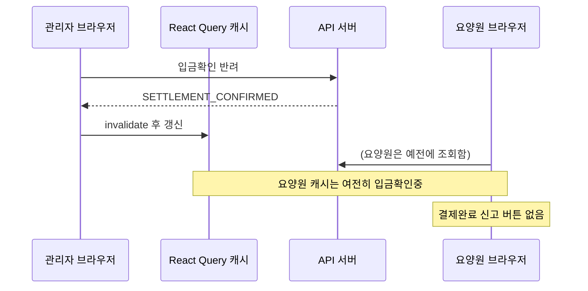
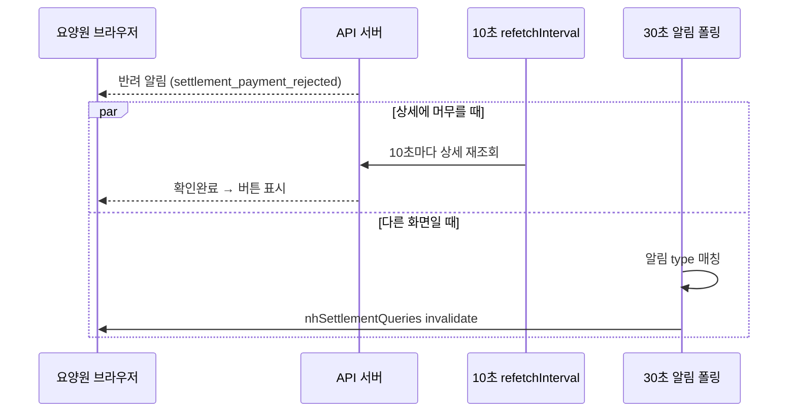

# 크로스 포털 정산 화면 동기화 — React Query·폴링·알림

> 작성일: 2026-06-08
> 맥락: 요양원에서 결제를 신고했는데 관리자 화면 버튼이 늦게 뜨거나, 관리자가 반려했는데 요양원 화면에 「결제완료 신고」가 안 보일 때 — **새로고침하면 되는데 왜 그런가?**

이 글은 React Query API 설명이 아니라, **정산 화면을 왜 폴링·알림 조합으로 맞췄는지**를 실무 관점에서 정리한다. 라이브러리를 바꿔도 반복되는 건 "다른 사용자가 바꾼 데이터를 내 화면에 언제 맞출 것인가"라는 동기화 문제다.

## 이 글의 질문

- 다른 사람(다른 포털·다른 브라우저)이 DB를 바꿨는데, **내 화면 버튼은 왜 안 바뀌나?**
- React Query `invalidateQueries`를 썼는데도 **상대 화면은 왜 그대로인가?**
- **10초 폴링**과 **30초 알림 폴링**을 같이 쓴 이유는?

## 핵심 (먼저 읽기)

| 상황 | 화면이 안 바뀌는 이유 | 대응 (이 레포) |
|------|----------------------|----------------|
| **같은 탭**에서 내가 API 호출 후 | `invalidate` 안 함, 또는 `staleTime` 안 지남 | 액션 성공 직후 `invalidateQueries` |
| **다른 브라우저·다른 역할**이 서버만 변경 | 내 탭의 React Query 캐시는 **모름** | ① 조건부 `refetchInterval` ② 알림 수신 시 `invalidate` |
| 상세에 **오래 앉아 있음** | stale이어도 **자동 재요청 트리거 없음** (`refetchOnWindowFocus: false`) | 대기 상태에서만 10초 폴링 |
| 목록·다른 페이지 | 상세 폴링만으로는 부족 | 알림 type별 `nhSettlementQueries` / `adminNhSettlementQueries` invalidate |

**한 줄:** `invalidate`는 **그 브라우저의 QueryClient** 안에서만 통한다. 크로스 포털은 **폴링 + 알림 브릿지**가 필요하다.

## 전제 (30초)

- **브라우저 A**: 요양원 담당자가 쓰는 화면 (결제완료 신고 등)
- **브라우저 B**: 회사 관리자가 쓰는 화면 (입금 확인·반려 등)
- **API 서버**: DB에 정산 상태를 저장하는 곳. A·B는 각각 HTTP로 조회한다
- **React Query**: 각 브라우저 탭 안에 "최근에 받아 둔 JSON 캐시"를 두고, 버튼·뱃지는 그 캐시를 그린다

## 한눈에

### 경로 1 — 증상이 나는 구성 (캐시만 믿음)



### 경로 2 — 보완 후 (대기 중 폴링 + 알림)



## 용어 (이 글에서만)

| 용어 | 한 줄 뜻 |
|------|----------|
| **staleTime** | "이 캐시를 N ms 동안은 신선하다고 본다" — 그동안 불필요한 재요청을 줄임 |
| **invalidate** | "이 키 캐시는 낡았다" 표시 → 다음에 쓰일 때 서버 재조회 |
| **refetchInterval** | 타이머로 주기적 재조회 (폴링) |
| **크로스 포털** | 요양원 URL 트리 vs 관리자 URL 트리 — **서로 다른 사용자·다른 탭** |
| **대기 상태** | 내 액션은 끝났고, **상대 역할의 다음 액션**만 남은 상태 |

## 목차

1. [크로스 포털 React Query — invalidate의 범위](#1-크로스-포털-react-query--invalidate의-범위)
2. [조건부 refetchInterval — 상대 처리 기다릴 때만](#2-조건부-refetchinterval--상대-처리-기다릴-때만)
3. [정산 도메인 — 입금확인 반려 ↔ 결제 신고](#3-정산-도메인--입금확인-반려--결제-신고)
4. [실무 메모 — 이 문제의 본질](#실무-메모--이-문제의-본질)

---

## 1. 크로스 포털 React Query — invalidate의 범위

이 절은 **"왜 상대가 한 일이 내 화면에 안 보이나"**를 React Query 관점에서 설명한다.

### 한 줄 요약

`queryClient.invalidateQueries`는 **지금 이 탭의 메모리**만 건드린다. 요양원 탭에서 invalidate해도 관리자 탭 캐시는 그대로다.

### 함정 한 가지

**착각:** "결제 신고 API가 성공했으니 관리자 화면도 갱신됐겠지."  
**실제:** 성공한 쪽 브라우저만 `nhSettlementQueries`를 invalidate한다. 관리자는 `adminNhSettlementQueries`를 **한 번도** invalidate하지 않는다.

### 실무 코멘트 ① — invalidate는 브로드캐스트가 아니다

```text
처음 React Query를 쓰면 invalidateQueries()를 호출했으니
다른 사용자의 화면도 바뀌겠다고 착각하기 쉽다.

실제로는 현재 탭의 QueryClient만 영향을 받는다.

운영 중에는

"관리자가 반려했는데 요양원 화면이 안 바뀝니다"

같은 문의가 들어오고,
원인을 추적보면 캐시 동기화 문제인 경우가 많다.
```

이건 React Query를 처음 쓰는 사람들이 특히 많이 틀리는 부분이다. invalidate는 "서버에 변경을 알렸다"가 아니라 "내 탭 캐시를 낡게 표시했다"에 가깝다.

### 왜 이렇게인가

React Query는 **서버 push가 아니라 pull(요청)** 모델이다. 캐시는 탭마다 독립적이다. 전역 `staleTime`(30초)·상세 `staleTime`(60초)이 있으면, stale이 되어도 **자동으로 다시 fetch하지 않는다** — 이 앱은 `refetchOnWindowFocus: false`라 탭 전환만으로도 안 바뀐다.

그래서 크로스 포털에서는 (1) **이벤트를 알려 줄 채널**(알림) + (2) **기다리는 동안 짧은 폴링**을 조합한다.

### 실무 코멘트 ③ — WebSocket을 안 쓴 이유

이론상 WebSocket·SSE가 더 실시간이다. 그런데 이 레포는 MVP 단계에서 아래를 먼저 봤다.

```text
이론상          WebSocket / SSE → 더 실시간

하지만 실무에서
- 서버 개발·인프라 비용
- 연결 유지·재연결·장애 대응
- MVP 일정

→ "10초면 업무상 충분하다"는 판단이 자주 나온다
```

정산 상세는 **상대 처리를 기다리는 동안만** 10초 폴링을 켠다. 전역 실시간 채널을 깔지 않고, "기다리는 화면"에만 비용을 쓰는 설계다. 나중에 동시 접속·알림 지연이 문제가 되면 그때 push 채널을 검토하면 된다.

### 참고 코드

앱 전역 — 포커스 refetch 끔, 기본 stale 30초:

```6:13:src/providers/AppProviders.tsx
const queryClient = new QueryClient({
  defaultOptions: {
    queries: {
      staleTime: 30_000,
      retry: 1,
      refetchOnWindowFocus: false,
    },
  },
});
```

요양원 — 결제 신고 후 **요양원 쿼리만** invalidate:

```115:117:src/routes/nursing-hospital/settlements/NHSettlementDetailPage.tsx
      await submitNhPaymentReport(id);
      await queryClient.invalidateQueries({ queryKey: nhSettlementQueries.details() });
      await queryClient.invalidateQueries({ queryKey: nhSettlementQueries.lists() });
```

### 이 레포에서는

| 파일 | 역할 |
|------|------|
| `src/lib/api/@queries/admin-settlements.ts` | 관리자 정산 `staleTime` (목록 30s, 상세 60s) |
| `src/lib/api/@queries/nh-settlements.ts` | 요양원 정산 동일 패턴 |
| `src/hooks/use-notification-polling.ts` | 알림 type → 해당 포털 쿼리 invalidate |

---

## 2. 조건부 refetchInterval — 상대 처리 기다릴 때만

이 절은 **전역 폴링 대신 "기다리는 상태"에서만 10초마다 조회**하는 패턴을 설명한다.

### 한 줄 요약

버튼이 **상대 역할의 액션**에 달려 있을 때만 `refetchInterval: 10_000` — 그 외에는 `false`로 API 낭비를 막는다.

### 함정 한 가지

**착각:** "staleTime 줄이면 다 해결."  
**실제:** stale이 되어도 **타이머·포커스·invalidate** 없으면 화면은 안 바뀐다. staleTime 0은 **마운트·재사용 시** 더 자주 가져올 뿐, 상세에 앉아 있으면 여전히 멈출 수 있다.

### 실무 코멘트 ② — staleTime은 자동 새로고침이 아니다

현업에서 정말 자주 틀리는 해석이다.

```text
staleTime = 30000

↓ (많은 사람의 착각)

30초 후 자동 재조회

실제로는

30초 후 stale 표시

만 된다.
```

그래서 실무에서 자주 나오는 대화:

```text
개발자 A: "staleTime 0으로 했는데 왜 안 바뀌죠?"
개발자 B: "refetch 트리거가 없잖아요."
```

stale은 "다시 가져와도 된다"는 **허가**이지, **명령**이 아니다. 상세에 오래 앉아 있으면 `refetchInterval`·알림 invalidate·수동 새로고침 중 하나가 있어야 화면이 움직인다.

### 왜 이렇게인가

관리자·요양원 **대칭**으로 "대기 상태"를 정의한다.

| 포털 | 대기 상태 (상대가 할 일) | 폴링 |
|------|-------------------------|------|
| 관리자 | `SETTLEMENT_CONFIRMED` (요양원 결제 신고 대기) | 10초 |
| 요양원 | `SETTLEMENT_PAYMENT_REPORTED` (관리자 입금 확인·반려 대기) | 10초 |

상태가 바뀌면(버튼 조건 충족) 폴링 함수가 `false`를 반환해 **자동 중단**된다.

### 실무 코멘트 ⑤ — 10초는 기술 문제가 아니라 비즈니스 결정

문서에 `10_000`이 박혀 있으면 "프레임워크 기본값"처럼 보이기 쉽다. 실제로는 UX와 서버 비용 사이 타협이다.

```text
1초 폴링   → API 과다, 서버·DB 부담
60초 폴링  → "버튼이 왜 안 뜨죠?" CS 증가

→ 10초: "잠깐 기다리면 된다"는 업무 리듬에 맞는 절충
```

정산은 초 단위 트레이딩이 아니다. 담당자가 상세를 보며 상대 처리를 기다리는 구간에서, 10초 지연은 허용 가능한 범위로 잡았다.

### 실무 코멘트 ⑥ — 폴링은 생각보다 싸다

주니어에게 흔한 착각: `폴링 = 나쁜 것`. 시니어 회의에서는 종종 반대다.

```text
동시 100명 × 10초 간격 = 분당 600 요청

→ 정산 상세처럼 좁은 화면·짧은 구간이면 부담이 크지 않을 수 있음

반면 WebSocket + Redis Pub/Sub + SSE 인프라는
도입·운영·장애 대응 비용이 훨씬 큼

→ "일단 폴링으로 가자"가 의외로 자주 나온다
```

조건부 폴링(대기 상태에서만)까지 겹치면, "항상 폴링"보다 훨씬 보수적으로 쓴다.

### 참고 코드

관리자 상세 — 상태에 따라 간격 결정:

```22:27:src/routes/admin/settlement/admin-nursing-home-billing-utils.ts
export function getAdminNhBillingDetailRefetchInterval(
  status: NhSettlementStatus | undefined,
): number | false {
  return status === 'SETTLEMENT_CONFIRMED' ? 10_000 : false;
}
```

요양원 상세 — 대칭:

```4:8:src/routes/nursing-hospital/settlements/settlement-detail-utils.ts
export function getNhSettlementDetailRefetchInterval(
  status: NhSettlementStatus | undefined,
): number | false {
  return status === 'SETTLEMENT_PAYMENT_REPORTED' ? 10_000 : false;
}
```

`useQuery`에 함수 형태로 연결 (데이터 바뀔 때마다 간격 재평가):

```ts
refetchInterval: (query) => getAdminNhBillingDetailRefetchInterval(
  query.state.data?.settlement.status,
),
```

### 이 레포에서는

| 파일 | 내용 |
|------|------|
| `AdminNursingHomeBillingDetailPage.tsx` | 관리자 상세 + refetchInterval |
| `NHSettlementDetailPage.tsx` | 요양원 상세 + refetchInterval |
| `*utils.test.ts` | `CONFIRMED` / `PAYMENT_REPORTED`일 때만 10_000 검증 |

---

## 3. 정산 도메인 — 입금확인 반려 ↔ 결제 신고

이 절은 **업무 상태 전이**와 **어떤 버튼이 언제 보이는지**를 도메인 언어로 정리한다.

### 정책 한 줄

입금 확인 반려 후 요양원은 `확인완료`로 돌아가 **결제완료 신고를 다시** 할 수 있고, 관리자는 요양원이 다시 신고하면 `입금확인중`에서 **입금 확인·반려** 버튼을 본다.

### 함정 한 가지

**착각:** "DB는 이미 바뀌었으니 UI도 즉시 맞겠지."  
**실제:** UI는 **마지막으로 받은 API 응답**의 `status` / `canReportPayment` / `getAvailableAdminBillingActions`로만 그린다. DB와 UI 사이에 **캐시·폴링 간격**이 끼어 있다.

### 실무 코멘트 ④ — DB는 바뀌었는데 화면은 안 바뀌는 이유

운영·CS에서 가장 흔한 패턴 중 하나다.

```text
운영팀: DB 확인했는데 값 바뀌어있는데요?
개발자: 브라우저 새로고침 해보셨어요?
운영팀: 새로고침하면 됩니다.
개발자: 그럼 캐시 문제네요.
```

DB는 SSOT이지만, **브라우저 UI는 마지막으로 받은 JSON**을 그린다. "DB와 화면이 어긋났다"는 말은 대부분 "클라이언트가 아직 모른다"는 뜻이다. 버그인지 설계상 지연인지는 **새로고침 후 맞는지**, **몇 초 뒤 맞는지**로 갈린다.

### 왜 이렇게인가 (흐름)

```text
확인완료 ──(요양원 결제 신고)──► 입금확인중 ──(관리자 입금 확인)──► 정산완료
                                    │
                                    └──(관리자 반려)──► 확인완료 (다시 신고 가능)
```

- **관리자 버튼** (`입금 확인` / `입금 확인 반려`): `SETTLEMENT_PAYMENT_REPORTED`일 때만
- **요양원 버튼** (`결제완료 신고`): `SETTLEMENT_CONFIRMED`일 때만 (`canReportPayment`)

알림은 "다른 탭·다른 화면"을 깨우는 용도다. 기획상 결제 신고 시 관리자 알림(`settlement_payment_reported`), 반려 시 요양원 알림(`settlement_payment_rejected`) — 서버 발송 후 프론트는 type별 invalidate로 목록·상세를 맞춘다.

### 참고 코드

알림 수신 시 쿼리 갱신 — 관리자·요양원 type 분리:

```11:22:src/hooks/use-notification-polling.ts
const ADMIN_NH_SETTLEMENT_NOTIFICATION_TYPES = new Set([
  'settlement_payment_reported',
]);

const NH_SETTLEMENT_NOTIFICATION_TYPES = new Set([
  'settlement_billed',
  'settlement_reissued',
  'settlement_objection_resolved',
  'settlement_payment_rejected',
]);
```

```62:68:src/hooks/use-notification-polling.ts
      if (ADMIN_NH_SETTLEMENT_NOTIFICATION_TYPES.has(latest.type)) {
        void queryClient.invalidateQueries({ queryKey: adminNhSettlementQueries.all() });
      }

      if (NH_SETTLEMENT_NOTIFICATION_TYPES.has(latest.type)) {
        void queryClient.invalidateQueries({ queryKey: nhSettlementQueries.all() });
      }
```

### 이 레포에서는

| 문서 | 내용 |
|------|------|
| `docs/nursing-hospital/settlement/settlement-detail.md` §3-3 | 결제완료 신고·관리자 알림 |
| `docs/notification.md` §2-3 | 관리자 수신 알림 목록 |
| `server/src/lib/notify-admin-nursing-home-settlement.ts` | 결제 신고 → super_admin 알림 |
| `server/src/lib/notify-nursing-home-settlement.ts` | 반려 → 요양원 알림 |

### 체감 지연 정리

| 경로 | 대략 최대 지연 |
|------|----------------|
| 상세에 머무름 + 조건부 폴링 | **~10초** |
| 목록·다른 페이지 + 알림만 | **~30초** (알림 폴링 주기) |
| 수동 새로고침 | 즉시 (캐시 무시하고 전체 로드) |

### 실무 코멘트 ⑦ — 이 구조의 본질은 eventual consistency

시니어 관점에서 보면, 이 화면은 **즉시 일관성(Strong Consistency)** 이 아니라 **몇 초 안에 맞춰지는 일관성(Eventual Consistency)** 을 허용한다.

```text
관리자 반려
    ↓
0~10초 (상세 폴링) 또는 0~30초 (알림 경로)
    ↓
요양원 화면 갱신
```

"반려 직후 0.1초 안에 버튼이 떠야 한다"는 요구가 없었다면, 이 지연은 **버그가 아니라 설계 선택**에 가깝다. 다만 CS·기획과 "최대 몇 초까지 괜찮은지"를 맞춰 두지 않으면, 운영팀은 버그로 보고 개발팀은 "캐시예요"로만 답하게 된다.

---

## 실무 메모 — 이 문제의 본질

```text
이 문제는 React Query를 잘 몰라서 생긴 문제가 아니다.

"다른 사용자가 변경한 데이터가 내 화면에 언제 반영되어야 하는가"
라는 동기화 문제다.

React Query, SWR, Apollo를 쓰더라도
같은 문제는 반복된다.

중요한 건 캐시 라이브러리가 아니라

- 누가 데이터를 바꾸는가
- 누가 그 변경을 알아야 하는가
- 얼마 안에 반영되어야 하는가

를 먼저 정의하는 것이다.
```

정산 화면은 그 답을 이렇게 내렸다. **같은 탭**은 액션 직후 invalidate, **크로스 포털**은 대기 상태 10초 폴링 + 30초 알림 브릿지, **허용 지연**은 상세 ~10초·다른 화면 ~30초. 라이브러리 API를 외운 뒤에도, 다음 기능에서는 이 세 가지 질문부터 다시 쓰면 된다.

---

## 더 볼 것 (선택)

- [TanStack Query — refetchInterval](https://tanstack.com/query/latest/docs/framework/react/guides/window-focus-refetching)
- 같은 레포: `.study/2026-05-28_react-query-optimistic-update.md` (같은 탭 낙관적 갱신)
- `docs/admin/settlement/nursing-home-billing-detail.md` — 관리자 상세 액션 정본
