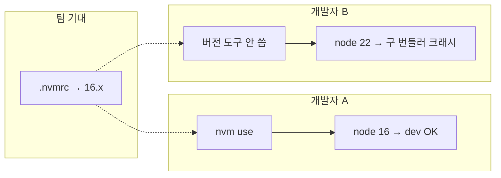

# .nvmrc와 Node 런타임 버전

> 작성일: 2026-06-08
> 맥락: clone·pull 후 dev 서버만 터지거나, 팀원마다 증상이 다른데 `node -v`는 안 맞춰 봤을 때
> 본문 주제: .nvmrc·버전 pin과 런타임 드리프트 — 의미·증상·맞추는 방법
> 관점: 팀 pin과 내 `node -v`가 같다고 가정해도 되나
> 범위: 로컬 학습 노트 — Git 미공유, 팀 공유 문서에서 참조하지 않음

## 이 글의 질문

- `.nvmrc` 파일은 자동으로 Node를 바꿔 주나?
- 같은 브랜치인데 왜 A는 되고 B는 `ERR_OSSL_EVP_UNSUPPORTED`인가?
- 팀 기준 Node를 맞추는 가장 단순한 방법은?

## 핵심 정리 (결론부터)

| | `.nvmrc`만 커밋됨 | `nvm use` / `fnm use` 후 | 자동 전환(fnm shell, direnv 등) |
|--|------------------|--------------------------|--------------------------------|
| **의미** | “이 버전 쓰자”는 **표지판(pin)** | 셸의 `node -v`가 pin에 맞게 바뀜 | 프로젝트 폴더 진입 시 전환 시도 |
| **`node -v`** | PC에 깔린 버전 그대로일 수 있음 | pin과 일치 | pin과 일치(설정이 맞을 때) |
| **팀 증상** | 사람마다 다른 Node로 dev 실행 | pin 기준으로 맞춤 | 습관·설정에 덜 의존 |
| **한계** | 파일만으로 런타임은 안 바뀜 | 매번 수동 또는 습관 필요 | 도구·셸 설정 선행 |

한 줄 결론: **`.nvmrc`는 권장 버전 메모이지, 자동 스위치가 아니다.** `node -v`를 pin과 맞추는 건 별도 작업이다.

## 배경 지식 (짧게만)

- **Node.js**: 터미널에서 `npm run dev` 같은 스크립트를 돌리는 **런타임**. OS에 전역 설치했거나, nvm/fnm으로 여러 버전 중 하나를 고른 상태다.
- **메이저 버전**: `16` → `17` → `22`처럼 앞자리가 바뀌는 단위. **OpenSSL·네이티브 모듈·번들러** 호환 경계가 여기서 자주 갈린다.
- **`.nvmrc`**: 프로젝트 루트(또는 하위 폴더)에 두는 **한 줄짜리 버전 pin**. nvm·fnm·asdf 등이 읽는다. 커밋만 한다고 PC의 Node가 바뀌지는 **않는다**.
- **드리프트(drift)**: pin(`.nvmrc`)과 실제 셸의 `node -v`가 어긋난 상태.

## 한눈에

팀은 `.nvmrc`로 “16을 쓰자”고 적어 두지만, 개발자마다 **실제로 쓰는 Node**는 다를 수 있다.



**`.nvmrc`에 적힌 버전은 팀이 같이 받지만, 실제 `node -v`는 PC마다 다를 수 있다.** `cd`만으로 맞춰지지 않으면 B처럼 최신 Node로 webpack 4·react-scripts 4가 깨질 수 있다.

## 용어 (이 글에서만)

| 용어 | 한 줄 뜻 |
|------|----------|
| `.nvmrc` | 프로젝트에 권장 Node 버전을 적어 두는 pin 파일 |
| nvm / fnm | Node 여러 버전을 설치·전환하는 CLI |
| pin | “이 버전을 쓰자”고 고정해 둔 값 (파일·`engines` 등) |
| 메이저 버전 | 16 → 17 → 22처럼 앞자리가 바뀌는 단위 |
| 드리프트 | pin과 실제 `node -v` 불일치 |
| `engines` | package.json에 허용 Node 범위를 적는 필드 |
| `ERR_OSSL_EVP_UNSUPPORTED` | Node 17+ OpenSSL 3에서 구 해시 알고리즘을 쓸 때 나는 대표 오류 |

---

## 관점

“레포를 clone했으니 팀과 같은 Node다”고 **가정하면 안 된다.** `.nvmrc`는 **의도를 적어 둔 SSOT 후보**일 뿐이고, 터미널의 `node -v`는 **전역 설치·다른 프로젝트에서 쓰던 버전**이 그대로일 수 있다. 문제를 “webpack 버그”로만 보면 안 되고, **pin과 런타임이 맞는지**를 먼저 본다. 판단 축은 세 가지다 — **누가** 맞출 것인가(개발자 vs CI vs 도구 자동화), **언제** 확인할 것인가(이슈 재현·온보딩 직후), **얼마나** 엄격히 강제할 것인가(습관 vs `engines` vs 업그레이드).

## 한 줄 요약

**`.nvmrc`는 “이 버전 써 달라”는 표지판이지, 자동 스위치가 아니다.** 터미널에서 맞춰 쓰지 않으면 로컬만 다른 Node로 돌아간다.

## 함정 한 가지

**착각:** “같은 브랜치니까 같은 환경이다.”  
**실제:** 브랜치는 코드만 같고, **Node는 각 PC 설정**이다. 이슈 재현·온보딩 시 **해당 프로젝트 폴더에서** `node -v`를 먼저 찍는다.

## 언제 문제가 보이나

| 상황 | 증상 |
|------|------|
| pin 16, 실제 22 + react-scripts 4 / webpack 4 | dev start 직후 `ERR_OSSL_EVP_UNSUPPORTED` |
| pin 16, 실제 16 | 대체로 정상 (다른 원인 가능) |
| CI는 16, 로컬 22 | “CI는 되는데 내 PC만 안 됨” / 반대도 가능 |
| README는 18, `.nvmrc`는 16 | 문서끼리 충돌 — 팀 합의로 하나를 SSOT로 |
| monorepo 하위에만 `.nvmrc` | 루트에서 `npm run` 하면 pin을 안 읽고 다른 Node로 실행 |

일반 확인 순서: (1) `.nvmrc`가 있는 **폴더**로 `cd` (2) `node -v`와 `.nvmrc` 메이저 일치 여부 (3) 다르면 `nvm use` / `fnm use` (4) 그다음 dev 스크립트 실행.

## 어떻게 맞추나

개인 → 팀 → 근본 순으로 보면 된다. 레거시 레포(react-scripts 4·webpack 4 등)에서는 **① `.nvmrc`에 맞추기**가 보통 기본이다.

### ① 개인 — 오늘 당장 dev 띄우기

1. `.nvmrc`가 있는 **폴더**로 `cd`
2. `node -v` 확인 — `.nvmrc`와 메이저(16·18·22 등)가 같은지
3. 다르면 `fnm use` 또는 `nvm use` (미설치 시 `fnm install` / `nvm install`)
4. 그다음 `npm run dev` 등 실행

**nvm vs fnm:** 둘 다 `.nvmrc`를 읽는다. fnm은 보통 더 빠르고 Windows에서 많이 쓰고, nvm은 예제·문서에 이름이 오래 나왔다. **이미 깔린 쪽**을 쓰면 된다.

### ② 팀 — 같은 증상 반복 줄이기

| 할 일 | 왜 |
|------|-----|
| `.nvmrc` 위치를 README에 한 줄로 | monorepo에서 루트 vs 하위 혼동 방지 |
| CI의 Node 버전 = `.nvmrc` 메이저 | “CI만 됨 / 로컬만 안 됨” 감소 |
| (선택) `package.json` `engines` | `npm install` 때 버전 불일치 경고 |
| (선택) fnm shell hook · direnv | `cd`할 때 자동 전환 — 매번 `use` 습관에 덜 의존 |

한 줄: **`.nvmrc`와 CI를 먼저 맞추고**, 로컬은 nvm/fnm으로 따라가게 한다.

### ③ 근본 — 시간 날 때

| 선택 | 언제 | 주의 |
|------|------|------|
| **`.nvmrc` 버전에 맞추기** | 레거시 번들러를 당분간 유지 | 기본 권장 — 우회보다 안전 |
| **`NODE_OPTIONS=--openssl-legacy-provider`** | 최신 Node를 꼭 써야 할 때만 | 개인 임시. 팀마다 환경이 달라짐 ([OpenSSL 노트](./2026-06-08_node-openssl-webpack.md)) |
| **webpack 5 / react-scripts 5+** | 마이그레이션 여유 있을 때 | 근본 해결 — 일정·회귀 테스트 필요 |

## 왜 이렇게인가

Node는 **메이저마다 내장 라이브러리(OpenSSL 등)** 가 바뀐다. 오래된 레포는 `package-lock.json`·`react-scripts` 버전으로 **특정 시점의 Node**를 가정한다. 개발자 PC는 OS 설치나 다른 프로젝트 때문에 **더 최신 Node**를 쓰는 경우가 많고, 그때 구 번들러가 OpenSSL 3과 부딪힌다. ([OpenSSL·webpack 노트](./2026-06-08_node-openssl-webpack.md))

`.nvmrc`는 그 갭을 줄이려는 **단일 진실 공급원(SSOT)에 가까운 pin**이다. 파일은 Git으로 공유되지만 **런타임은 각 PC가 따로 맞춰야** 한다. nvm/fnm의 자동 전환 shell hook이나 direnv를 켜지 않으면 **수동 `nvm use`** 가 필요하다.

## 참고 코드

일반적으로 `.nvmrc`는 버전 문자열 한 줄이다. nvm/fnm이 이 파일을 읽어 전환할 버전을 정한다.

```text
16.20.2
```

이 레포에서는 `carenation` 하위에 pin이 있고, `dev:all`은 **Node 버전을 검사하지 않고** 바로 `react-app-rewired`를 호출한다. 그래서 드리프트가 그대로 빌드 체인에 전달된다.

```1:1:carenation/.nvmrc
16.20.2
```

## 이 레포에서는

| 항목 | 내용 |
|------|------|
| pin 위치 | `carenation/.nvmrc` |
| 권장 버전 | 16.20.2 |
| 세션 당시 실제 | Node v22.16.0 (로그 기준) |
| 겪은 패턴 | pin은 16인데 `node -v`는 22 → `dev:all`의 COMMON이 먼저 죽고 INTEGRATED(3000)만 살아 프록시 ECONNREFUSED |
| 연쇄 증상 | webpack 4 OpenSSL 오류 → COMMON(5300) 미기동 → 프록시 ECONNREFUSED |
| 로컬 맞추기 | `cd carenation` 후 `nvm install 16.20.2` / `nvm use` (fnm 동등 명령) |
| 임시 우회 | Node 22 유지 시 `NODE_OPTIONS=--openssl-legacy-provider` ([OpenSSL 노트](./2026-06-08_node-openssl-webpack.md)) |

### 확인 체크리스트

1. `cd carenation`
2. `node -v`가 `.nvmrc`와 같은 메이저(16.x)인지
3. 다르면 `nvm use` 또는 fnm으로 16.20.2 전환
4. `npm run dev:all` — **[COMMON]** compile 성공 여부 먼저
5. 그다음 `http://localhost:3000/common/...` 접속

프록시만 “안 되는 것처럼” 보이면 업스트림(5300)이 pin 드리프트로 죽었는지 먼저 본다. ([프록시·업스트림 노트](./2026-06-08_proxy-econnrefused-upstream.md))

## 더 볼 것 (선택)

- [fnm 자동 전환](https://github.com/Schniz/fnm#shell-setup) — 디렉터리 이동 시 `.nvmrc` 적용
- [Volta](https://volta.sh/) — Node 버전을 **package.json**에 적고 프로젝트마다 자동 전환. `.nvmrc`와 역할이 겹칠 수 있어 팀 합의 후 도입
- [mise](https://mise.jdx.dev/) — Node뿐 아니라 Python 등 **여러 런타임**을 한 도구로 pin. `.nvmrc`만 있는 JS 레포에서는 당장 필요 없음
- 관련: [OpenSSL·webpack](./2026-06-08_node-openssl-webpack.md), [프록시·업스트림](./2026-06-08_proxy-econnrefused-upstream.md)
