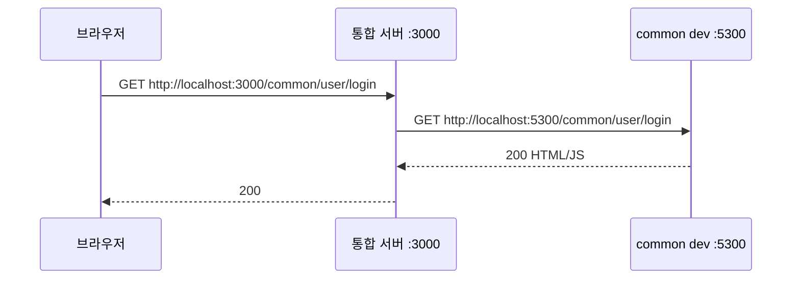
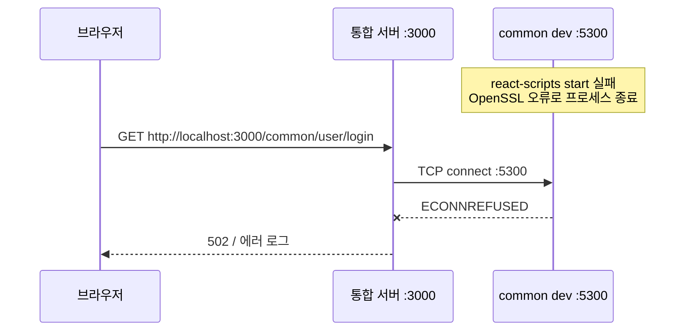
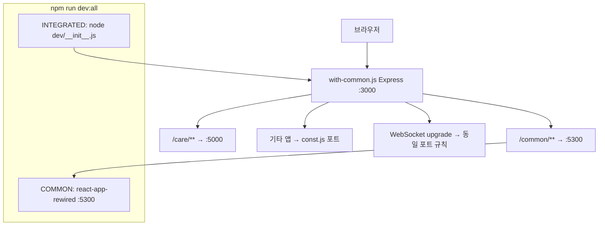

# 프록시 ECONNREFUSED — 설정이 아니라 업스트림 미기동

> 작성일: 2026-06-08
> 맥락: 통합 개발 주소(예: `localhost:3000`)로 접속했는데 `/common/...`만 `ECONNREFUSED`가 나고, “프록시가 고장 난 것 같다”고 느낄 때

## 이 글의 질문

- 프록시 로그에 `GET /common/... → http://localhost:5300`이 찍히는데 왜 실패하나?
- INTEGRATED(3000)는 떴는데 COMMON(5300)만 안 되는 이유는?
- 이 레포의 “통합 dev 서버”는 브라우저와 각 앱 사이에서 정확히 무엇을 하나?

## 핵심 (먼저 읽기)

| 구성 | 역할 | 이 레포 포트 |
|------|------|----------------|
| **브라우저** | 사용자는 보통 **한 주소**(통합 게이트)만 연다 | `http://localhost:3000` |
| **통합 dev 서버 (INTEGRATED)** | 경로 prefix로 **어느 앱 dev 서버로 넘길지** 중계 | 3000 (`dev/with-common.js`) |
| **각 앱 dev 서버 (업스트림)** | 실제 React 번들·HMR을 제공 | common → **5300**, care → 5000, … |
| **ECONNREFUSED** | 중계 서버는 살아 있지만 **넘기려는 쪽 포트에 리스너 없음** | COMMON이 OpenSSL 오류로 안 떠 있으면 발생 |

**이 레포에서 증상을 “프록시 버그”로 오해하기 쉬운 이유:** INTEGRATED는 Express로 잘 뜨고, 로그도 “5300으로 보냈다”고 정확히 찍힌다. 실패 원인은 프록시 라우팅이 아니라 **5300에 붙을 서버가 없는 것**이다.

## 전제 (30초)

- **프록시(중계 서버)**: 클라이언트 요청을 받아 **다른 서버로 그대로 전달**하고 응답을 돌려준다. URL 경로만 보고 “이건 common 앱 것”이라고 판단할 수 있다.
- **업스트림(upstream)**: 프록시가 **실제로 연결하는 뒤쪽 서버**. 여기서는 각각의 `react-app-rewired start` 인스턴스.
- **dev 서버 두 겹**: 이 레포는 “앱 자체 dev 서버”와 “여러 앱을 한 입구로 모는 통합 서버”를 **동시에** 띄운다 (`dev:all`).

## 한눈에

### 경로 A — 정상 (업스트림도 기동됨)



### 경로 B — 이번 세션 증상 (업스트림만 죽음)



## 용어 (이 글에서만)

| 용어 | 한 줄 뜻 |
|------|----------|
| INTEGRATED | `dev/with-common.js` — 포트 3000 통합 게이트 |
| COMMON | carenation 앱 자체의 dev 서버 — 포트 5300 |
| `dev:all` | COMMON + INTEGRATED를 `concurrently`로 동시 실행하는 npm 스크립트 |
| 업스트림 | 프록시가 전달하는 **뒤쪽** dev 서버 |
| ECONNREFUSED | OS가 “그 포트에 연결할 프로세스 없음”이라고 거절한 것 |
| HMR / WebSocket upgrade | 코드 수정 시 화면 갱신용 소켓 — 통합 서버가 포트별로 다시 중계 |

---

## 1. 프록시·ECONNREFUSED

### 한 줄 요약

**프록시는 전화 교환원이다. 상대 번호(5300)에 아무도 안 받으면 “연결 거절”이 나고, 교환원(3000) 설정이 틀린 게 아니다.**

### 함정 한 가지

**착각:** `[INTEGRATED] GET /common/... → localhost:5300` 로그가 있으니 프록시가 **잘못된 URL**로 보낸다.  
**실제:** 그 로그는 “의도한 대로 5300에 연결 시도함”을 뜻한다. 다음 줄 `ECONNREFUSED`는 **5300이 비어 있다**는 뜻이다. 로그 **COMMON** 쪽을 먼저 본다.

### 언제 발생하나

| 조건 | ECONNREFUSED? |
|------|----------------|
| 통합 서버(3000)만 켜고 common(5300)은 안 켬 | 예 |
| common `start`가 크래시 후 종료 | 예 |
| 프록시 `const.js` 경로·포트 오타 | 가능하지만, 로그의 target URL이 맞으면 우선 업스트림 의심 |
| 방화벽·다른 머신 IP | 로컬 `localhost`면 드묾 |

### 왜 이렇게인가

HTTP 프록시는 TCP 연결을 **대신 맺어 줄 뿐**이다. 뒤 서버가 없으면 Node의 `http-proxy` / `http-proxy-middleware`는 `connect ECONNREFUSED`를 그대로 올린다. 설정 파일이 `/common` → `5300`으로 맞게 되어 있어도, **리스닝 프로세스가 없으면** 같은 결과다.

디버깅 순서: (1) 터미널에서 **COMMON** 프로세스가 “Compiled successfully”까지 갔는지 (2) `localhost:5300` 직접 접속 (3) 그다음 통합 3000 경유.

### 이 레포에서는

| 확인 | 방법 |
|------|------|
| COMMON 생존 | `dev:all`에서 `[COMMON]` 로그에 webpack 성공 메시지 |
| 직접 접속 | 브라우저 `http://localhost:5300` (common 단독) |
| 통합 경유 | `http://localhost:3000/common/...` |
| 이번 원인 | COMMON이 `ERR_OSSL_EVP_UNSUPPORTED`로 종료 → 5300 비어 있음 ([OpenSSL 노트](./2026-06-08_node-openssl-webpack.md)) |

---

## 2. 통합 dev 서버 구조 (with-common.js)

지금부터는 **INTEGRATED(3000)가 여러 앱 dev 서버를 어떻게 한 입구로 묶는지**를 설명한다. carenation 레포의 `dev/` 폴더가 그 구현이다.

### 한 줄 요약

**브라우저는 3000만 본다. `/common`으로 시작하면 5300으로, `/care`면 5000으로 넘기고, 정적 파일·HMR 소켓도 같은 규칙으로 따라간다.**

### 왜 이렇게 쓰나

모노레포처럼 **앱이 여러 개**인데, 로컬에서는 도메인·쿠키·경로 prefix를 운영과 비슷하게 맞추고 싶다. 각 앱은 원래 포트에서 CRA/Vite dev를 돌리고, 통합 서버만 **경로 스위치** 역할을 한다.

### 한눈에 — 컴포넌트



### 경로·포트 표 (const.js)

| URL prefix | 업스트림 포트 | 앱 이름 |
|------------|---------------|---------|
| `/common` | 5300 | common (carenation) |
| `/care` | 5000 | care |
| `/community` | 5500 | community |
| `/integrated` | (정적 UI) | 통합 런처·설정 페이지 |

전체 목록은 `carenation/dev/const.js`의 `DEV_SERVER_LIST`에 있다.

### 동작 단계

1. **`dev:all`**: `concurrently`가 두 프로세스를 병렬 실행한다 — COMMON(실제 common 앱) + `node dev/__init__.js`(통합 서버 감시·재시작).
2. **`with-common.js`**: Express 앱을 3000에 띄운다.
3. **쿠키 `currentApp`**: 어떤 prefix로 들어왔는지 기억해, 뒤이어 오는 **정적 파일** 요청을 올바른 포트로 보낸다.
4. **`createServiceProxy`**: `/common` 등 prefix마다 `http-proxy-middleware`로 `localhost:{port}`에 전달한다.
5. **`upgrade` 핸들러**: HMR용 WebSocket도 referer·쿠키로 포트를 고른 뒤 중계한다.

### 참고 코드

`createServiceProxy`는 경로 prefix와 포트를 묶어 중계한다.

```107:111:carenation/dev/utils.js
    const proxy = createProxyMiddleware(rootPath, {
      target: `http://localhost:${targetPort}`,
      ...WS_PROXY_OPTIONS,
      onProxyReq: (_, request) => {
        console.log('\x1b[33m%s\x1b[0m', `🌐 [HTTP] ${request.method} ${request.url} → http://localhost:${targetPort}${request.url}`);
```

통합 서버는 등록된 모든 서비스에 대해 프록시 미들웨어를 붙인다.

```117:119:carenation/dev/with-common.js
DEV_SERVER_LIST.forEach((server) => {
  app.use(createServiceProxy(server.name));
});
```

기동 시 콘솔에 `common/** → :5300` 같은 매핑이 출력된다.

```167:173:carenation/dev/with-common.js
server.listen(DEV_SERVER_PORT.integrated, () => {
  console.log('🚀 Unified dev server running at\n');
  console.log(`    \x1b[32m➜\x1b[0m  Local:   \x1b[36mhttp://localhost:${DEV_SERVER_PORT.integrated}\x1b[0m`);
  ...
  DEV_SERVER_LIST.forEach((server) => {
    console.log(`   - ${server.path}/** → :${server.port}`);
```

### 함정 한 가지 (통합 서버)

**착각:** “3000만 켜면 모든 앱이 된다.”  
**실제:** 3000은 **중계만** 한다. care·community 등은 **각자의 포트에서 dev 서버를 따로** 띄워야 한다. common만 `dev:all`에 포함되고, care는 보통 care 레포에서 `start`(5000)를 별도 실행한다.

### 도구 비교 — 어디를 치나

| 시나리오 | Request URL | 누가 요청 | 비고 |
|----------|-------------|-----------|------|
| A — common 단독 | `GET http://localhost:5300/common/user/login` | 브라우저 탭 Origin `http://localhost:5300` | 프록시 없음, COMMON만 필요 |
| B — 통합 경유 | `GET http://localhost:3000/common/user/login` | 브라우저 탭 Origin `http://localhost:3000` | INTEGRATED가 5300으로 중계 |
| C — 업스트림 다운 | B와 동일 | B와 동일 | 3000은 살아 있어도 5300 없으면 **ECONNREFUSED** |

HTTP 메서드·경로는 B가 A와 같게 전달되지만, **브라우저 주소창 Origin**은 3000으로 통일된다는 점이 운영 환경과 비슷하게 맞추려는 이유다.

## 더 볼 것 (선택)

- `carenation/dev/public/` — 통합 런처 UI
- `/integrated/settings` — 포트 override API (`__port-config`)
- [Node OpenSSL + webpack](./2026-06-08_node-openssl-webpack.md) — COMMON이 안 뜨는 근본 원인


### 프록시 ECONNREFUSED — 설정이 아니라 업스트림 미기동

* `ECONNREFUSED`는 프록시 설정 오류보다 대상 서버가 꺼져 있을 때 더 자주 발생한다.
* 이 프로젝트에서 3000 포트는 실제 앱이 아니라 요청을 전달하는 프록시(중계 서버) 역할이다.
* `/common/...` 요청이 오면 3000이 5300(common 서버)으로 전달한다.
* 만약 5300 서버가 실행되지 않았으면 연결이 거부(`ECONNREFUSED`)된다.
* 따라서 3000이 살아 있어도 5300이 죽어 있으면 `/common` 경로는 실패한다.
* 프록시 로그에 `→ localhost:5300`이 보인다면 전달 자체는 정상적으로 시도된 것이다.
* 문제를 찾을 때는 프록시보다 먼저 대상 서버(업스트림)가 실행 중인지 확인해야 한다.
* 이 프로젝트에서는 COMMON(5300)이 OpenSSL 오류로 종료되면서 연쇄적으로 `ECONNREFUSED`가 발생했다.
* 디버깅 순서는 "프록시 확인 → 업스트림 확인"이 아니라 "업스트림 확인 → 프록시 확인"이 더 효율적이다.

현재 프로젝트 흐름:

```text id="4d6q3q"
브라우저
    ↓
localhost:3000
(통합 프록시)
    ↓
localhost:5300
(COMMON 서버)

5300 실행 중
    ↓
정상 응답

5300 종료됨
    ↓
ECONNREFUSED
```

**핵심은 "프록시가 고장 난 것이 아니라, 프록시가 연결하려는 서버가 떠 있지 않은 경우가 많다"는 점이다.**
