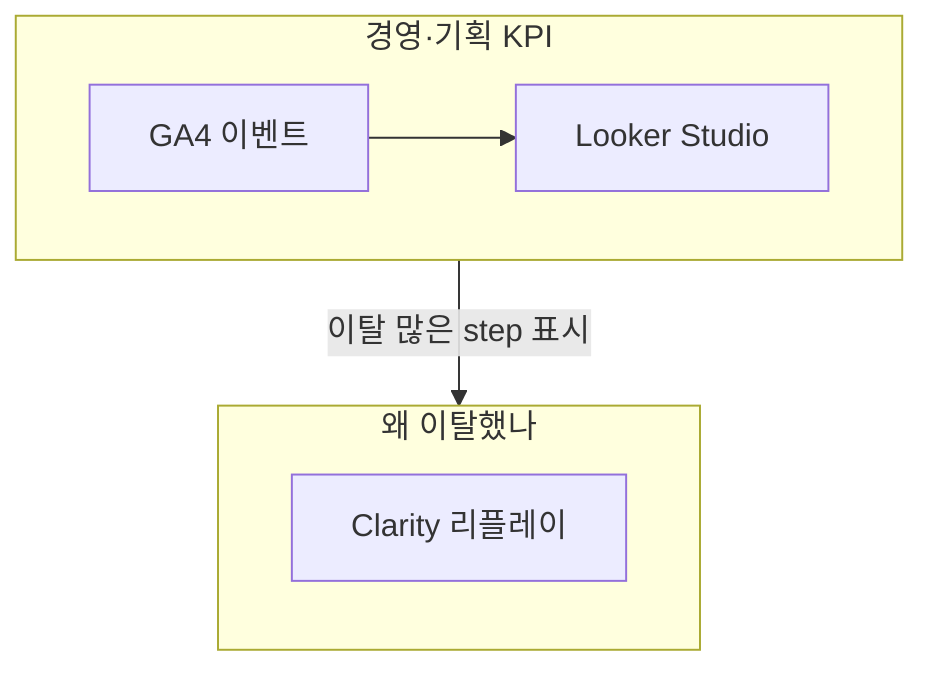

# GA4 vs Clarity — 잔존·클릭 시간 KPI에 누가 맞는지

> 작성일: 2026-06-09
> 맥락: 기능 개선을 위해 “페이지 잔존율”, “클릭 후 다음 액션까지 시간”을 보고 싶은데 GA4와 Clarity 중 무엇을 써야 하는지

## 이 글의 질문

- GA4만으로 잔존율·단계 소요 시간을 볼 수 있나?
- Clarity는 그런 숫자 대시보드를 주나?
- 둘 다 켜져 있으면 역할을 어떻게 나누나?

## 핵심 (먼저 읽기)

| 목표 | GA4 | Clarity |
|------|-----|---------|
| 단계별 **이탈률·완료율** (숫자) | ◎ (커스텀 이벤트 후) | △ |
| 단계 간 **평균 소요 시간** | ◎ (이벤트 타임스탬프) | △ (개별 관찰) |
| **왜** 막혔는지 (클릭·스크롤) | △ | ◎ 리플레이·히트맵 |
| 경영 **주간 KPI** 보고 | ◎ + Looker | ✗ |
| 지금 care 설정만으로 위 KPI | △ pathname만 | △ 녹화만 |

**조합:** GA4(+Looker) = **숫자·퍼널**, Clarity = **이탈 구간 원인 파악**.

## 전제 (30초)

- **GA4**: 방문·이벤트를 **집계**해 표와 퍼널로 보여 주는 분석 제품
- **Clarity**: 사용자 세션을 **녹화**해 화면에서 무엇을 했는지 재생해 보는 제품
- **잔존율(퍼널 맥락)**: 다음 단계로 **얼마나 넘어갔는지** (안 넘어간 비율 = 이탈)

## 한눈에



## 용어 (이 글에서만)

| 용어 | 한 줄 뜻 |
|------|----------|
| 잔존(퍼널) | 다음 단계까지 **남아 있는 비율** (이탈의 반대 개념으로 쓰이기도 함) |
| 세션 리플레이 | 사용자 화면 조작을 영상처럼 다시 보기 |
| 히트맵 | 많이 클릭·스크롤한 위치를 색으로 표시 |
| pageview | GA4의 URL 방문 기록 |

---

## 한 줄 요약

**잔존율·클릭→다음 액션 시간 같은 KPI는 GA4(이벤트 설계 필수)가 맞고, Clarity는 그 숫자가 이상할 때 ‘사람이 뭘 했는지’ 보는 도구다.**

## 함정 한 가지

**“Clarity도 분석 도구니까 GA4 대신 쓰면 된다”** → Clarity는 **전체 사용자 평균 “3단계에서 47초 걸림”** 같은 경영 보고용 집계에 약하다. 샘플 세션을 **눈으로** 보는 데 강하다.

## 왜 이렇게인가

**페이지 잔존**을 제대로 보려면 “어느 **단계**에 들어왔고 어디서 끊겼는지” 경계가 필요하다. care의 GA4는 **pathname pageview만** 자동 전송한다. 등록 단계 이름·다음 버튼 시각은 **커스텀 이벤트** 없이는 퍼널 시간 분석이 거의 불가능하다.

Clarity는 앱 시작 시 `init`하고 로그인 사용자를 `identify`한다. URL이 바뀌면 녹화에 반영되지만, **기획 단계 코드**와 자동 매핑되지는 않는다. GA4에 `step` 파라미터를 심어 두면 Clarity 필터와 **같은 구간**을 대조하기 쉽다.

**클릭 후 다음 액션까지 시간**은 “이벤트 A 시각 → 이벤트 B 시각” 차이다. GA4는 이벤트 스트림을 저장하므로 퍼널 탐색·BigQuery로 계산 가능하다. Clarity 타임라인으로 **한 명**은 재지만, **전사 평균**은 GA4 쪽이다.

## 언제 무엇을 보나 (care REAL)

| 도구 | care에서 하는 일 |
|------|------------------|
| GA4 | 라우트마다 pageview + (추가 예정) regist 이벤트 |
| Clarity | init + userId identify |
| 네이티브 | `care_reg_cp` 등 소수 전환만 |

개발·스테이징(`REAL` 아님)에서는 둘 다 **꺼져 있어** 로컬에서 KPI가 안 보이는 게 정상이다.

## 이 레포에서 증상을 못 느낀 이유

- **로컬/CI:** `SERVER_TYPE !== 'REAL'` → GA4·Clarity 미초기화
- **pathname만:** 등록 단계 KPI를 아직 **이벤트로 안 보냄**
- **Clarity만 켠다고** 퍼널 숫자가 생기지 않음

## 참고 코드

GA4 pageview (자동):

```10:14:care/src/app/hooks/GA4Tracker.ts
    ReactGA.send({ hitType: 'pageview', page: location.pathname });
```

Clarity 사용자 식별:

```10:11:care/src/app/hooks/useClarity.ts
      Clarity.identify(String(userId), undefined, undefined, String(userId));
```

## 이 레포에서는

| 질문 | 답 |
|------|-----|
| GA4만으로 잔존·시간 KPI? | 이벤트 추가 후 가능, 지금은 부족 |
| Clarity만으로? | 경영 KPI용 아님 |
| 추천 워크플로 | GA4 퍼널로 이탈 step 찾기 → Clarity로 해당 URL 리플레이 |

## 더 볼 것 (선택)

- [커스텀 이벤트 설계](./2026-06-09_ga4-funnel-custom-events.md)
- [Looker 대시보드](./2026-06-09_looker-ga4-exec-dashboard.md)
