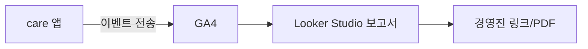
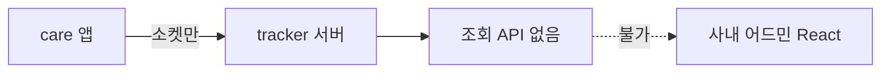

# 경영 대시보드는 Looker Studio에 만든다

> 작성일: 2026-06-09
> 맥락: 잔존율·등록 퍼널을 “경영진이 볼 대시보드”로 만들고 싶은데, 프론트 레포에 어드민 페이지를 새로 만들어야 하는지 헷갈릴 때

## 이 글의 질문

- 대시보드 UI는 `protector` 같은 프론트 repo에 만들면 되나?
- 백엔드 조회 API가 없으면 어떻게 하나?
- GA4와 Looker Studio는 각각 무슨 역할인가?

## 핵심 (먼저 읽기)

| 구분 | 어디서 하나 | 비고 |
|------|-------------|------|
| **데이터 수집** | care 앱 코드 (GA4 이벤트) | `protector` repo |
| **데이터 저장·집계** | Google Analytics 4 | Google 클라우드 |
| **차트·경영 공유** | **Looker Studio** (웹) | 코드 repo **밖** |
| 사내 React 어드민 | 별도 개발 | **집계 API 필요** → 이 레포에 없음 |

**이 레포 기본:** 트래킹 **조회** API 없음 → 경영 대시보드는 **Looker Studio + GA4**가 최단 경로.

## 전제 (30초)

- **GA4**: 앱에서 보낸 pageview·이벤트를 **저장**하는 분석 창고
- **Looker Studio**: GA4 등에 연결해 **표·그래프 보고서**를 만드는 무료 BI 도구 (구 Google Data Studio)
- **프론트 repo**: 사용자용 앱 코드. 경영용 차트를 꼭 여기 넣을 필요는 없음

## 한눈에

### 권장 경로 (백엔드 없음)



### 안 되는 경로 (API 없을 때)



## 용어 (이 글에서만)

| 용어 | 한 줄 뜻 |
|------|----------|
| Looker Studio | Google 보고서·대시보드 빌더 (lookerstudio.google.com) |
| GA4 속성 | 앱 하나에 대응하는 Analytics 프로젝트 (care REAL: `G-KBDL3D7MVJ`) |
| 데이터 소스 | Looker가 읽어 오는 원본 (여기서는 GA4) |
| 퍼널 차트 | 단계별 통과·이탈을 보여 주는 그래프 |

---

## 한 줄 요약

**경영 대시보드는 프론트 repo가 아니라 Looker Studio 웹에서 만들고, 데이터는 GA4에서 가져온다.**

## 함정 한 가지

**“대시보드 개발 = React 페이지 하나 추가”** → 집계 API·권한·캐시·PDF 예약까지 **백엔드·인프라**가 따라온다. 트래킹 조회 API가 없으면 **차트만 그릴 데이터 경로가 없다**. GA4+Looker는 그 부분을 Google이 맡는다.

## 왜 이렇게인가

이 monorepo(`protector`)를 검색하면 `ptr_event_view` **송신** 코드는 있지만, `GET /analytics/...` 같은 **조회 API는 없다**. 소켓 서버(`socket.carenation.co.kr`)는 레포 밖이다.

경영진은 보통 **고정 레이아웃·주간 추이·한 장 요약**을 원한다. GA4 탐색 화면은 분석가용에 가깝고, Looker는 **URL 공유·뷰어 권한·PDF**에 맞다.

개발팀이 할 일은 **앱에서 이벤트를 정확히 보내는 것**까지. 그 다음은 PM/데이터가 Looker에서 드래그로 차트를 배치해도 된다.

## Looker에 넣을 차트 예 (간병 등록)

1. 주간 **등록 퍼널** (step_view 단계 순)
2. 단계별 **이탈률**
3. 시작 대비 **완료율** (`regist_complete`)
4. 전주 대비 추이 (날짜 비교)
5. (이벤트 심은 뒤) 단계 간 **평균 시간** — GA4 퍼널 또는 BigQuery

## 작업 분담

| 역할 | 할 일 | 장소 |
|------|-------|------|
| 프론트 | GA4 커스텀 이벤트 | `care/src/...` |
| PM/데이터 | 보고서·차트 | lookerstudio.google.com |
| 경영 | 보고서 링크 열람 | 브라우저 |

## 참고 코드

이 레포에서 GA4 초기화 (수집 쪽만):

```79:81:care/src/app/index.tsx
if (SERVER_TYPE === 'REAL') {
  ReactGA.initialize('G-KBDL3D7MVJ');
```

Looker는 **코드가 아니라** Google 계정으로 GA4 속성 연결 후 보고서 생성.

## 이 레포에서는

- **만들지 않는 것:** `protector` 안의 경영 대시보드 페이지
- **만드는 것:** care의 GA4 이벤트 (선행 조건)
- **Clarity:** clarity.microsoft.com — KPI 대시보드 아님, UX 원인용

## 더 볼 것 (선택)

- [커스텀 이벤트 설계](./2026-06-09_ga4-funnel-custom-events.md)
- [페이지 추적 3층](./2026-06-09_spa-page-tracking-layers.md)
