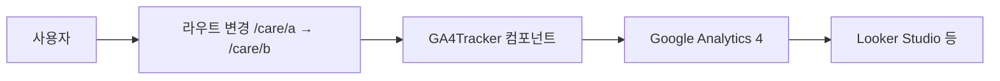
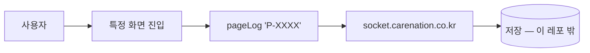

# SPA에서 페이지 추적하는 3가지 방법

> 작성일: 2026-06-09
> 맥락: React 같은 SPA(한 번 로드된 뒤 화면만 바뀌는 앱)에서 “사용자가 어떤 화면을 봤는지”를 어떻게 기록하는지 헷갈릴 때

## 이 글의 질문

- 페이지를 “추적한다”는 말이 코드마다 다른 뜻인가?
- GA4, Clarity, 소켓(page_code)은 같은 일을 하는 건가?
- 자동으로 URL만내면 등록 단계별 분석이 되나?

## 핵심 (먼저 읽기)

| 방식 | 무엇을내나 | 누가 켜나 | 대시보드·KPI |
|------|---------------|-----------|--------------|
| **GA4 pageview** | URL 경로 (`/care/list`) | 라우트 바뀔 때 **자동** | Google Analytics / Looker |
| **Clarity** | 세션·클릭·스크롤(녹화) | 앱 시작 시 **한 번** init | clarity.microsoft.com |
| **소켓 page_code** | `P-MCXXX` 같은 **화면 코드** | 페이지마다 **수동** `pageLog()` | 별도 서버(이 레포에 조회 API 없음) |

**이 레포 기본(care):** GA4·Clarity는 REAL에서 켜지고, 소켓 `viewPage`는 **함수만 있고 호출은 거의 꺼짐**.

## 전제 (30초)

- **브라우저 / WebView**: 사용자 화면
- **프론트 앱(SPA)**: React Router로 **페이지 전체 새로고침 없이** 화면만 교체
- **분석 도구(GA4, Clarity)**: 브라우저에서 보낸 신호를 모아 차트·리플레이로 보여 줌
- **소켓 서버**: 앱이 `page_code` 등을 실시간으로 **밀어 넣는** 별도 서버(조회는 다른 시스템)

## 한눈에

### 경로 A — GA4 자동 pageview (care 기본)



### 경로 B — 소켓 page_code (carenation 등에서 활성)



두 경로는 **동시에 쓸 수 있지만**, care는 A만 실질적으로 돌아가고 B는 꺼져 있는 상태에 가깝다.

## 용어 (이 글에서만)

| 용어 | 한 줄 뜻 |
|------|----------|
| SPA | 새로고침 없이 JS로 화면만 바꾸는 웹앱 |
| pageview | “이 URL을 봤다”는 방문 기록 |
| page_code | 사람이 정한 화면 ID (`P-MCPRC` 등) |
| REAL | 운영 환경 (`REACT_APP_SERVER_TYPE === 'REAL'`) |
| WebView | 앱 안에 끼워 넣은 미니 브라우저 |

---

## 한 줄 요약

**페이지 추적 = (1) URL 자동 기록, (2) 행동 녹화, (3) 화면 코드 수동 기록** 중 무엇을 택하느냐의 문제이고, care는 지금 (1)+(2)만 켜져 있다.

## 함정 한 가지

**“GA4 쓰니까 페이지 트래킹 끝”** → SPA에서 pathname만내면 **등록 7단계가 같은 URL 패턴이거나 query만 바뀌면** 단계별 이탈·체류 시간은 **안 나온다**. 그건 [등록 퍼널 이벤트](./2026-06-09_ga4-funnel-custom-events.md) 글을 보면 된다.

## 왜 이렇게인가

예전에는 소켓으로 `page_code`를 페이지마다 박아 **내부 리포트**를 만들었다. carenation 메인 앱은 아직 `pageLog()`가 많다. care는 리뉴얼(등록 플로우 교체) 과정에서 소켓 호출을 **주석 처리**했고, 대신 GA4 자동 pageview + Clarity로 넘어간 흔적이 있다.

자동 pageview의 장점은 **개발 부담이 적다**는 것이다. 라우트만 있으면 대부분의 “어디로 갔나”는 잡힌다. 단점은 **비즈니스 단계(등록 step 3)** 와 URL이 1:1이 아닐 때 분석이 거칠어진다는 것이다.

소켓 방식은 **화면 코드가 기획·DB와 맞춰져 있으면** 정밀하지만, **조회 API·대시보드가 없으면** 데이터가 쌓여도 경영이 못 본다. 이 레포에는 조회 API가 없어서, 경영용은 GA4 + Looker 쪽이 현실적이다.

## 참고 코드

일반적으로: 라우터 `location`이 바뀔 때마다 analytics SDK에 hit를 보낸다.

이 레포에서는:

```10:14:care/src/app/hooks/GA4Tracker.ts
  useEffect(() => {
    ReactGA.set({ user_id: userId });
    ReactGA.send({ hitType: 'pageview', page: location.pathname });
  }, [location]);
```

소켓 송신(비활성에 가까움):

```34:47:care/src/app/constants/newSocket.ts
export const viewPage = (typeCode: string, params?: SocketProps): void => {
  // ...
  SOCKET_SERVER?.emit('ptr_event_view', data);
};
```

## 이 레포에서는

| 프로젝트 | GA4 | Clarity | 소켓 page_code |
|----------|-----|---------|----------------|
| care | ✅ REAL, pathname | ✅ REAL | ⚠️ 코드만, 호출 주석 |
| carenation | ✅ | ✅ | ✅ `pageLog` 활성 |
| app-visitcare | ❌ | ❌ | ❌ |

care 앱 진입점에서 REAL일 때만 GA4·Clarity 초기화:

```79:93:care/src/app/index.tsx
if (SERVER_TYPE === 'REAL') {
  ReactGA.initialize('G-KBDL3D7MVJ');
  Clarity.init('sk83kgxh8g');
}
// ...
<GA4Tracker />
```

## 더 볼 것 (선택)

- [GA4 vs Clarity 역할](./2026-06-09_ga4-vs-clarity-roles.md)
- [등록 퍼널 커스텀 이벤트](./2026-06-09_ga4-funnel-custom-events.md)
- [Looker 대시보드 위치](./2026-06-09_looker-ga4-exec-dashboard.md)
