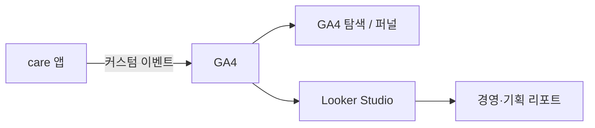

# care 간병 등록 플로우 GA4 커스텀 이벤트 도입

> **작성일:** 2026-06-10
> **대상:** care 앱 (`protector/care`)  

---

## 요약

care 앱의 간병 등록 리뉴얼 플로우(`/care/newRegist/*`)에 **Google Analytics 4(GA4) 커스텀 이벤트**를 추가했습니다.  
기존에는 URL 기반 pageview만 수집되어 단계별 이탈·전환·소요 시간을 분석하기 어려웠습니다. 이번 변경으로 등록 시작부터 완료까지의 **퍼널 지표**를 GA4 및 Looker Studio 대시보드에서 구성할 수 있는 데이터 기반이 마련되었습니다.

본 작업은 **대시보드 UI를 구현한 것이 아니라**, 경영·기획 보고에 필요한 **측정 데이터를 앱에서 GA4로 전송**하도록 한 프론트엔드 변경입니다.

---

## 배경 및 문제 정의

### 조직적 요구사항

- 등록 플로우 **단계별 잔존·이탈** 파악
- **다음 액션까지 소요 시간** 등 행동 지표 기반 기능 개선
- **경영진** 대상 주기적 리포트 (Looker Studio 등 외부 BI 활용)
- 자사 백엔드 트래킹 조회 API **부재** → GA4 중심 수집·시각화 전략 채택

### 기존 care 트래킹의 한계

| 수단 | 수집 내용 | 한계 |
|------|-----------|------|
| GA4 `GA4Tracker` | `pathname` pageview | query string 미포함, 비즈니스 **단계**와 1:1 대응 어려움 |
| Microsoft Clarity | 세션 리플레이 | 정량 KPI·퍼널 집계용이 아님 |
| 네이티브 `analyticsEvent` | `care_req_*`, `care_reg_cp` 등 소수 전환 | **중간 단계**·클릭 행동 미수집 |
| 소켓 `viewPage` / `page_code` | carenation과 동일 패턴 | care에서는 **호출 비활성**(주석), 조회 API 없음 |

pathname만으로는 “어느 기획 단계에서 이탈했는가”, “다음 버튼 클릭 후 얼마나 걸렸는가”에 답하기 어렵습니다. 특히 `details` 화면은 URL 쿼리(`?step=1|2|3`)로 하위 단계가 나뉘나, 기존 pageview에는 반영되지 않았습니다.

---

## 변경 목적

1. **간병 등록 퍼널**을 GA4 이벤트 단위로 정의·수집
2. 단계 진입, 명시적 이동(다음/이전), 이탈, 폼 완료, 최종 등록 완료를 **구분 가능**하게 기록
3. GA4 퍼널 탐색 및 Looker Studio 연동을 위한 **일관된 이벤트 스키마** 확보

---

## 솔루션 개요

### 데이터 흐름



### 설계 원칙

- **REAL 환경에서만 전송** — 기존 GA4·Clarity와 동일 (`REACT_APP_SERVER_TYPE === 'REAL'`)
- **이벤트 정의 일원화** — `registAnalytics.ts`에서 이름·파라미터 관리
- **자동 + 수동 혼합**
  - 라우트 변경: `RegistRenewalTracker`가 `regist_step_view` 자동 전송
  - 버튼 클릭: 각 단계 컴포넌트에서 `regist_nav` 수동 전송 (pageview로는 클릭 구분 불가)

---

## 이벤트 명세

### 이벤트 목록

| 이벤트명 | 발생 시점 | 주요 파라미터 |
|----------|-----------|---------------|
| `regist_start` | 메인에서 등록 플로우 진입 | `source`: `main_button` \| `resume` |
| `regist_step_view` | `/care/newRegist/*` 화면 진입 | `step`, `is_edit`, `detail_step`, `disease_search` |
| `regist_nav` | 다음/이전 버튼으로 단계 이동 | `action`, `from_step`, `to_step`, `is_edit`, `location_type` 등 |
| `regist_wizard_complete` | newRegist 종료 후 `/care/detail/register` 진입 | `last_step` |
| `regist_abandon` | newRegist 중 플로우 외 경로로 이탈 | `last_step` |
| `regist_complete` | `/care/success` 공고 등록 완료 | `job_type`, `is_family` (기존 `care_reg_cp`와 병행) |

### 단계(`step`) 값

| URL 세그먼트 | `step` 값 |
|--------------|-----------|
| `serviceRule` | `service_rule` |
| `serviceWay` | `service_way` |
| `period` | `period` |
| `location` | `location` |
| `location/find/*` | `location_find`, `location_find_hospital`, `location_find_house`, `location_find_house_user` |
| `patient` | `patient` |
| `patient/search` | `patient_search` |
| `details` | `details` (+ `detail_step` 1~3) |
| `certificate` | `certificate` |

### 공통 파라미터

- `user_id` — `localStorage.user_id` (있을 경우)
- `is_edit` — 편집 모드 여부 (`1` / 미전송)

---

## 구현 구조

### 신규 파일

| 파일 | 역할 |
|------|------|
| `care/src/app/constants/registAnalytics.ts` | GA4 이벤트 전송 API (`trackRegistStart`, `trackRegistStepView`, …) |
| `care/src/app/hooks/RegistRenewalTracker.tsx` | 라우트 감시, 단계 진입·이탈·위저드 완료 자동 추적 |

### 수정 파일

| 파일 | 변경 내용 |
|------|-----------|
| `care/src/app/index.tsx` | `RegistRenewalTracker` 마운트 |
| `MainStartButton.tsx` | `regist_start` |
| `registRenewal/services/ServiceRule.tsx` | `regist_nav` |
| `registRenewal/services/ServiceWay.tsx` | `regist_nav` |
| `registRenewal/period/Period.tsx` | `regist_nav` |
| `registRenewal/location/Location.tsx` | `regist_nav` |
| `registRenewal/patient/NewPatientInfo.tsx` | `regist_nav` |
| `registRenewal/details/Detail.tsx` | `regist_nav` (하위 step 포함) |
| `registRenewal/certificate/Certificate.tsx` | `regist_nav` |
| `care/success.tsx` | `regist_complete` |

### 퍼널 흐름 (신규 등록 기준)

```text
regist_start
  → regist_step_view (service_rule)
  → regist_step_view (service_way)
  → regist_step_view (period)
  → regist_step_view (location)
  → regist_step_view (patient)
  → regist_step_view (details, detail_step=1~3)
  → regist_step_view (certificate)
  → regist_wizard_complete
  → … (매칭·결제 등 후속 플로우)
  → regist_complete
```

`regist_nav` 이벤트는 단계 간 **의도적 이동(다음/이전)** 을 보조하여, 체류 시간·이탈 지점 분석의 해상도를 높입니다.

---

## 기대 효과

배포 후 REAL 트래픽이 축적되면 다음 분석이 가능합니다.

| 분석 항목 | 활용 이벤트 |
|-----------|-------------|
| 등록 시작 대비 완료 **전환율** | `regist_start` → `regist_complete` |
| **단계별 이탈률** (퍼널) | `regist_step_view` 시퀀스, `regist_abandon` |
| 상세 질문지 **하위 단계** 이탈 | `detail_step` 파라미터 |
| 병원/가정 등 **맥락별** 비교 | `location_type`, `is_edit` |
| 단계 간 **소요 시간** (추정) | 동일 사용자의 `regist_step_view` / `regist_nav` 타임스탬프 차이 |
| 경영 **주간 리포트** | GA4 → Looker Studio 퍼널·추이 차트 |

Clarity는 이탈이 많은 구간의 **정성적 원인**(UI 혼란, 입력 오류 등) 확인용으로 병행 사용합니다.

---

## 본 변경의 범위 밖

- Looker Studio 대시보드 **구성** (PM·데이터 담당, GA4 웹)
- GA4 **맞춤 정의** 등록 및 전환 이벤트 마킹
- BigQuery 연동·고급 SQL 집계
- `app-visitcare` 등 타 서비스 적용
- 소켓 `ptr_event_view` / 자사 백엔드 트래킹 복구

---

## 검증 방법

1. **환경:** `REACT_APP_SERVER_TYPE=REAL` 배포 환경 (로컬·CI에서는 이벤트 미전송)
2. **GA4 실시간 보고서:** `regist_step_view`, `regist_nav` 등 수신 확인
3. **탐색 → 퍼널 분석:** `regist_start` ~ `regist_complete` 단계 구성 후 1~2주 데이터 검증
4. **Looker Studio:** GA4 속성 `G-KBDL3D7MVJ` 연결 후 경영용 1페이지 프로토타입

이벤트가 GA4 관리 화면에 반영되기까지 수 시간~24시간이 걸릴 수 있습니다.

---

## 추천 진행 순서 (배포 이후)

> **한 줄 요약:** REAL에 올린 뒤 → GA4에서 숫자로 이탈 step 확인 → (선택) 보고용 차트 → 이탈 많은 곳만 Clarity로 영상 확인 → 그래도 부족할 때만 유료 분석 툴 검토.

### 1단계 — 코드 배포 (지금)

| | |
|--|--|
| **할 일** | stash에 있는 GA4 커스텀 이벤트를 **REAL 환경에 배포** |
| **왜** | 등록 단계(`regist_step_view`, `regist_nav` 등) 데이터가 GA4로 쌓이기 시작해야 함 |
| **확인 방법** | GA4 → **실시간** → 이벤트에 `regist_step_view` 등이 보이는지 (반영까지 수 시간 걸릴 수 있음) |
| **비용** | 0원 |

### 2단계 — 데이터 모으기 (1~2주)

| | |
|--|--|
| **할 일** | 별도 작업 없이 **실사용자 트래픽**이 쌓이게 둠 |
| **왜** | 하루 이틀 데이터로는 이탈률·체류 시간을 말하기 어려움 |
| **비용** | 0원 |

### 3단계 — GA4에서 숫자 확인 (개발·기획)

| | |
|--|--|
| **할 일** | GA4 **탐색 → 퍼널** 등으로 아래 확인 |
| **볼 것** | ① `regist_start` → 각 step → `regist_complete` **전환율** ② `regist_abandon`의 **last_step**(어디서 나갔는지) ③ `regist_step_view`와 `regist_nav` **시간 차이**(다음 버튼까지 대략 몇 분) |
| **이걸로 답하는 질문** | “어느 등록 단계에서 사람이 가장 많이 빠지나?” “그 단계에서 다음 누르기까지 얼마나 걸리나?” |
| **비용** | 0원 |

**GA4 설정 (배포 직후 권장):** 관리자 → 이벤트 **맞춤 정의** (`step`, `detail_step` 등) 등록.

### 4단계 — 보고용 차트 (선택, 기획·PM)

| | |
|--|--|
| **할 일** | **Looker Studio**에 GA4 연결 → 퍼널·전환율 **1페이지** |
| **왜** | GA4 화면만으로는 경영·기획 공유가 불편할 수 있음 |
| **안 해도 됨** | 3단계 GA4만으로 분석 가능 |
| **비용** | 0원 (Looker Free) |

### 5단계 — “왜 이탈했는지” 영상으로 보기 (3단계에서 이탈 step 나온 뒤)

| | |
|--|--|
| **할 일** | **Microsoft Clarity** → 필터 **Visited URL** = 이탈 많은 step (예: `/care/newRegist/period`) → **세션 녹화** 몇 개 재생 |
| **왜** | GA4는 **숫자**만 알려줌. 버튼을 못 찾는지, 입력에서 막히는지는 **영상**으로 봐야 함 |
| **주의** | Clarity는 원래 켜져 있음. **이탈 1~2위 step만** 골라 보기 (전체 녹화 훑지 않기) |
| **비용** | 0원 |

### 6단계 — 유료 분석 툴 (대부분 여기까지 안 감)

**아래가 꼭 필요할 때만** 검토합니다.

- “등록 화면에서 **첫으로 누른 버튼**이 뭔지 **전체 사용자 통계**로 보고 싶다”
- “**모든 클릭** 순서·시간을 코드 없이 모으고 싶다”

| 도구 | 한 줄 | care 규모(월 ~5.8만 세션) |
|------|------|---------------------------|
| **PostHog** | 클릭 자동 수집. **짧은 PoC**만 (newRegist만, 2주, 과금 상한 $0) | PoC 0원 가능 / 전체 풀 수집 시 유료 |
| **Heap** | PostHog와 비슷, 연 **수백만 원대~** 견적 | 무료 한도(1만 세션/월) 초과 |
| **FullStory** | Clarity와 **녹화 겹침** | Clarity 유지 시 **후순위** |

### 단계별 체크리스트

```text
[ ] REAL 배포 완료
[ ] GA4 실시간에서 regist_* 이벤트 확인
[ ] GA4 맞춤 정의 등록
[ ] 1~2주 후 퍼널·이탈 step 정리
[ ] (선택) Looker 1페이지
[ ] 이탈 상위 step → Clarity 리플레이
[ ] (필요 시만) PostHog PoC
```

### 하지 않아도 되는 것 (오해 방지)

| 오해 | 실제 |
|------|------|
| “분석이 안 돼서 새 툴이 필요하다” | Clarity·GA4 pageview로 **경로·녹화는 이미 됨** |
| “Clarity에 코드 더 넣으면 단계별 녹화가 쪼개진다” | **한 세션 통 녹화**는 그대로. 코드는 **찾기 쉽게** 하는 용도 |
| “PostHog PoC = 항상 0원” | **newRegist만·짧게**일 때 0원. care **전체** autocapture는 이벤트 많아 **유료** 가능 |

---

## 후속 작업 (기술·데이터 심화, 선택)

1. BigQuery Export 후 단계 간 소요 시간 중앙값·백분위 SQL 정의
2. Clarity `setTag`로 GA4 이탈 step과 리플레이 필터 연동
3. `regist_first_interaction` 등 **첫 클릭** 이벤트 추가 (PostHog 없이 GA4만으로 보강)

---

## 참고

- GA4 pageview 구현: `care/src/app/hooks/GA4Tracker.ts`
- 간병 등록 라우트: `care/src/app/index.tsx` (`/care/newRegist/*`)